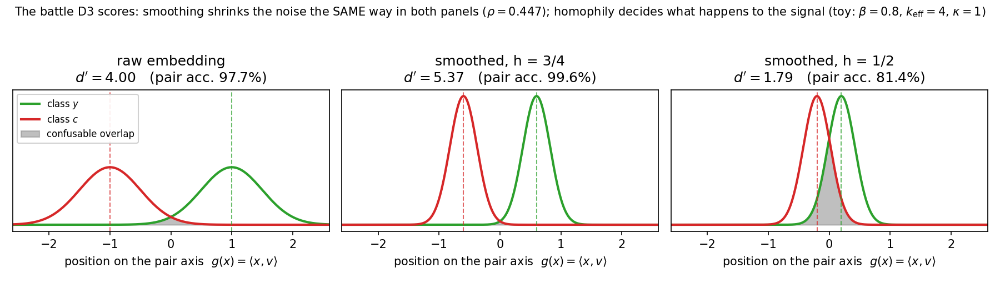
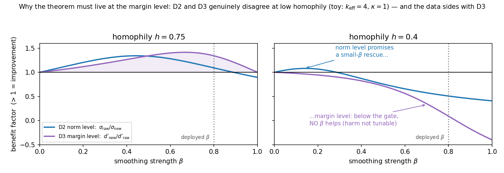
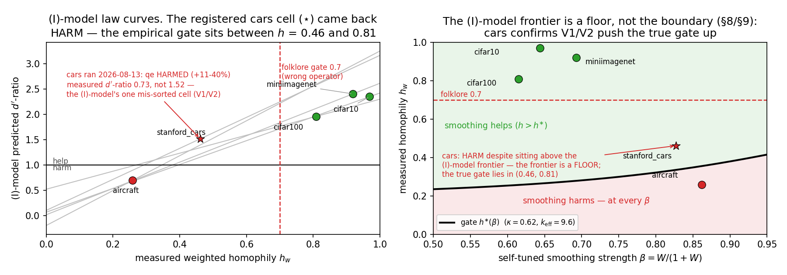

# Theorem D3, letter by letter — a learning edition

Status: v1.0 (2026-08-12). Companion to `docs/dwt_denoise_theorem.md` (the
research edition, plain-ASCII) and `docs/dwt_theory.md` (the proof-draft
ledger). This file is **pedagogical**: every symbol is introduced before it
is used, every proof step is annotated with *why* it is legal, every claim
that borrows from the literature says exactly what was borrowed, and a small
worked example is carried through all three theorems so you can compute
everything by hand.

> **How to read this file.** The math here is written in real LaTeX
> (`$...$` / `$$...$$`). It will NOT render in a raw terminal — open it in
> **VS Code and press `Ctrl+Shift+V`** (markdown preview), or view it on
> GitHub / Obsidian / Typora, all of which render the math natively. If you
> must read in a terminal, use the ASCII research edition
> (`dwt_denoise_theorem.md`) side by side; the two use identical symbols.

> **STATUS AFTER THE CARS RUN (2026-08-13) — read this first.** Sections
> 1–7 teach the theorems as originally derived under idealization (I).
> They are still the right thing to learn — but the cars experiment and
> the follow-up diagnostics (Sections 8–9 and research edition §8b)
> changed the standing of the *quantitative* claims:
>
> - **Validated:** D3's *level* and *link* — the margin $d'$ is the right
>   quantity (its measured sign predicts the qe gain/harm verdict 5/5
>   across datasets), harm-not-tunable, one-hop optimality, and the
>   wrong-way self-tuning of $\beta$ all hold empirically.
> - **Falsified:** the (I)-model's *numbers*. The $\sqrt{k}$ noise
>   dividend does not exist (measured noise shrink 0.90–0.98, not
>   0.31–0.43): within-class "noise" is ~80–95% a structured local field
>   shared with pool neighbors, so averaging cancels almost nothing. The
>   drift damage is also overcounted at high homophily (the field absorbs
>   it; effective $\kappa$ drops from ~0.6–0.75 to ~0 at $h \ge 0.8$
>   while staying ~0.31–0.35 at $h \le 0.46$).
> - **Revised mechanism:** qe is a **mean-field mover**, not a variance
>   reducer — it helps iff the local field flows toward the own-class
>   mode. The corrected theorem (D3′, two-component noise model with
>   structured fraction $\phi$) is scoped but NOT yet derived: its
>   variance law is settled ($N^2 = \phi + (1-\phi)(1-\beta)^2$,
>   $\phi \approx 0.78$–$0.96$ measured), its signal law is open (needs
>   the field-absorption/mode-sharpening term). See Section 7.1 for
>   which corollaries survive.

**Verification note.** Before writing this file, three checks were run
(2026-08-12): (1) DAPS Theorem 2, Proposition 2, footnote 5, and the
"self-built kNN graph left for future work" passage were extracted verbatim
from the ICML 2023 PDF and match what our documents claim about them; (2)
every algebraic step in D1/D2/D3 below was re-derived independently of the
research edition; (3) all five rows of the measured-constants table
(Section 8) were recomputed from the closed-form formulas — they match to
rounding (max deviation 0.01). Literature pointers appear inline as [tags]
resolved in Section 11.

---

## 1. The story in plain words (no math)

Our pipeline takes SSL embeddings and runs conformal prediction (CP) on
them. Before CP sees the embeddings, we apply **DWT**: **D**enoise →
**W**hiten → **T**runcate. The Denoise stage is `qe` (alpha-query-expansion,
borrowed from image retrieval [R19]): replace each point by a weighted
average of itself and its $k$ nearest neighbors *from the unlabeled pool*.

Empirically, qe shrinks prediction sets a lot on some datasets (CIFAR-100,
miniImageNet, CIFAR-10) and reliably *hurts* on others (Aircraft) — and no
knob setting rescues the hurting datasets. We want a theorem that explains
**when averaging helps and when it hurts**, sharply enough to reproduce that
regime map.

The intuition to hold onto:

- **Averaging cancels noise.** Averaging $k$ independent noisy things
  shrinks the noise by $\approx 1/\sqrt{k}$. This is why qe should help.
- **Averaging drags you toward your neighbors.** If some neighbors belong
  to a *different class*, the average is pulled toward that class's
  territory. This is a *bias*, it does not average away, and it points in
  the worst possible direction — toward exactly the class you are most
  confusable with. This is why qe can hurt.
- The battle between these two effects is decided by **homophily** $h$:
  the fraction of your neighbors that share your class. High $h$ → noise
  cancellation wins. Low $h$ → the drag wins.

The three theorems formalize this battle at three different "levels",
and the punchline is that **only the third level gets the physics right**:

| Level | Object measured | Verdict on "does qe help?" | Theorem |
|---|---|---|---|
| 1. Per-point distance | $\lVert x - \mu_y \rVert$ for one point, worst case | only certifies repair of unusually noisy points | D1 |
| 2. Average distance | $\mathbb{E}\lVert x - \mu_y\rVert^2$ | says *some* amount of qe always helps — **too optimistic**, contradicts the data | D2 |
| 3. Class separation | signal-to-noise of the margin between two classes | help iff $h > h^\ast$, a threshold with no tunable constants — **matches the data** | D3 |

The progression is itself the lesson: the quantity CP set size responds to
is not "how far points sit from their class mean" but "how well two
confusable classes separate along the axis the score uses." A transform can
improve the first while wrecking the second — that is precisely what qe
does on Aircraft.

---

## 2. The cast of characters

Read this section slowly once; everything later is mechanical after it.
Setting: $K$ classes in $\mathbb{R}^d$ (think $d = 768$ SSL embedding
space, after the W/T stage has made noise roughly isotropic — see §2.1).

### 2.1 The world (data model M1)

| Symbol | Read as | What it is |
|---|---|---|
| $\mu_c$ | "mu-c" | the **anchor** (population mean) of class $c$ — think "class center". |
| $x = \mu_y + e$ | — | a labeled point of class $y$: its anchor plus a personal noise vector $e$. |
| $e$ | "noise of $x$" | zero-mean random vector, covariance $\Sigma$. |
| $u = \mu_{c(u)} + \xi_u$ | — | a **pool** point: its own class's anchor plus its own noise $\xi_u$. The pool is unlabeled data, independent of cal/test. |
| $\sigma^2 = \operatorname{tr}\Sigma$ | "full noise energy" | total noise variance summed over all $d$ directions. |
| $\sigma_v^2 = v^\top \Sigma v$ | "noise along $v$" | noise variance in ONE direction $v$. Crucial distinction: $\sigma^2$ counts all $d$ directions, $\sigma_v^2$ only one. After whitening, $\sigma_v$ is the same for every $v$ — that is whitening's job. |
| $\Delta_{\min}, \Delta_{\max}$ | — | smallest / largest distance between two anchors. |

Why "anchors"? Because the prototype-cosine score classifies by distance to
class means; the class mean is the ground-truth object our representation is
trying to be close to. This mirrors DAPS [Z23], where the ground-truth
object is the true label distribution $p_i$ (see the dictionary in the
research edition §1): **their** model outputs approximate a continuous
$p_i$; **our** embeddings approximate one of $K$ discrete anchors.

A note on normalization: the deployed map ends with an L2-normalization,
but the prototype-cosine score is scale-invariant, so the normalization is
invisible to everything we prove. All statements are for the pre-norm
average. (Research edition, Remark 1.1.)

### 2.2 The smoother (what qe actually computes)

The deployed code (`exchangeable_features._qe_smooth`, $k=10$, $a=3$) does:

$$
T_D(x) \;=\; \mathrm{L2norm}\!\Big(x + \sum_{u \in N_k(x)} w_u(x)\, u\Big),
\qquad w_u(x) = \max(\cos(x,u), 0)^a .
$$

| Symbol | Read as | What it is |
|---|---|---|
| $N_k(x)$ | "neighborhood of $x$" | the $k$ pool points nearest to $x$ in cosine distance. |
| $w_u$ | "weight of neighbor $u$" | cosine similarity to the power $a$; more similar neighbors count more. $a$ is the "alpha" in alpha-QE [R19]. |
| $W = \sum_u w_u$ | "total neighbor weight" | how much total mass the neighborhood carries relative to the ego's own weight of $1$. |

Because the ego $x$ enters with weight $1$ and the neighbors with total
weight $W$, the map is a **convex combination**:

$$
T_D(x) \;\propto\; (1-\beta)\,x + \beta\,\nu(x),
\qquad
\beta = \frac{W}{1+W},
\qquad
\nu(x) = \sum_{u \in N_k(x)} \frac{w_u}{W}\, u .
$$

| Symbol | Read as | Intuition |
|---|---|---|
| $\beta$ | "smoothing strength" | how far $x$ moves toward the neighborhood average. $\beta = 0$: no smoothing. $\beta = 1$: replace $x$ entirely by the average. **Not a free knob in our method** — it is self-tuned by $W$ (Corollary C3 makes this precise; DAPS's $\lambda$ is the free-knob version of the same object). |
| $\nu(x)$ | "nu, the neighborhood average" | the weighted mean of the neighbors. All the action is in what $\nu$ is close to. |

This convex-combination structure is the *same* structure as DAPS's
diffusion $\hat\pi_i = (1-\lambda)\pi_i + \frac{\lambda}{|N_i|}\sum_j \pi_j$
[Z23, Eq. of Thm 2 — verified verbatim] and as one step of graph
convolution / Laplacian smoothing [LHW18], [NTM19]. That structural match is
what lets us port their proof template.

### 2.3 The neighborhood diagnostics (all measurable from the pool)

Fix an ego $x$ of class $y$ and its realized neighborhood. Define:

| Symbol | Read as | Formula | Intuition |
|---|---|---|---|
| $k_{\mathrm{eff}}$ | "effective neighbor count" | $W^2 / \sum_u w_u^2$ | Kish's effective sample size [K65]: unequal-weight averaging over $k$ points cancels noise only as much as *equal*-weight averaging over $k_{\mathrm{eff}} \le k$ points would. Example: weights $(1,1,1,1) \Rightarrow k_{\mathrm{eff}}=4$; weights $(1,.1,.1,.1) \Rightarrow k_{\mathrm{eff}} \approx 1.6$. Measured: $\approx 9.3$–$9.9$ at $k=10$, i.e. weights are near-uniform in practice. |
| $h_w$ | "(weighted) homophily" | $\sum_{u:\,c(u)=y} w_u / W$ | fraction of neighbor *weight* carrying the ego's own class. $h_w = 1$: perfectly pure neighborhood. This is the quantity logged as `purity` in our experiments. |
| $\bar{d}$ | "d-bar, the foreign drift" | $\sum_{u:\,c(u)\neq y} \frac{w_u}{W}\big(\mu_{c(u)} - \mu_y\big)$ | the *systematic* pull that wrong-class neighbors exert, expressed as a vector pointing from your anchor toward theirs. Note it involves only **anchors**, not noises — this is the part of the damage that will never average away. |
| $\Delta_F(x)$ | "local anchor spread" | $\max_{u \text{ foreign}} \lVert \mu_{c(u)} - \mu_y \rVert$ | how far away the foreign anchors in this neighborhood are, worst case. Gives the crude bound $\lVert \bar d\rVert \le (1-h_w)\,\Delta_F$. |
| $C(x)$ | "the composition" | $(\{w_u\}, \{c(u)\}, \beta)$ | *who* was selected, with what weights, from which classes. Theorems D2/D3 condition on $C$: they take the neighborhood as given and ask what the noises do. |

### 2.4 The margin-level objects (used only in D3)

| Symbol | Read as | Formula | Intuition |
|---|---|---|---|
| $v$ | "the pair axis" | $(\mu_y - \mu_c)/\Delta_{\mathrm{pair}}$ | unit vector from class $c$'s anchor toward class $y$'s anchor, for a confusable pair $(y, c)$. |
| $\Delta_{\mathrm{pair}}$ | "pair separation" | $\lVert \mu_y - \mu_c \rVert$ | distance between the two anchors. |
| $g(x)$ | "the margin statistic" | $\langle x, v\rangle$ | the coordinate of $x$ along the pair axis. One number per point. Class-$y$ points should score high, class-$c$ points low. This is (up to affine bookkeeping) the prototype-cosine score margin — see Section 10. |
| $D_y, D_c$ | "the pair drifts" | $D_y = \sum_{u \in F(x_y)} \frac{w_u}{W}\,\langle \mu_y - \mu_{c(u)}, v\rangle$ (and symmetrically $D_c$) | how much of the foreign drag on a $y$-ego (resp. $c$-ego) lands **along the pair axis** — i.e. the component of the damage that actually erodes this pair's separation. $F(\cdot)$ = the foreign neighbors. |
| $\kappa$ | "kappa, drift concentration" | $\dfrac{D_y + D_c}{\big((1-h_y) + (1-h_c)\big)\,\Delta_{\mathrm{pair}}}$ | what fraction of the impurity's *potential* damage is realized on this axis. $\kappa = 1$: every foreign neighbor is the partner class, pulling exactly along $v$. $\kappa < 1$: impurity is spread over other classes whose pull is partly off-axis (measured: $0.59$–$0.76$). $\kappa > 1$ is possible outside the idealization (Section 9). |
| $\rho$ | "rho, the noise-shrink factor" | $\sqrt{(1-\beta)^2 + \beta^2/k_{\mathrm{eff}}}$ | by how much smoothing multiplies the noise standard deviation. Always $< 1$ for $\beta \in (0,1]$ — smoothing *always* reduces noise. The question is only whether the signal shrinks *less*. |
| $d'$ | "d-prime" | $\dfrac{\text{mean separation}}{\text{common sd}}$ along $v$ | the **standardized margin** = signal-to-noise ratio of the two classes on the pair axis. Borrowed from signal detection theory [GS66]; identical to the two-class Fisher discriminant ratio [F36] evaluated on the *fixed* axis $v$. For equal-variance Gaussians the Bayes accuracy of the pair is $\Phi(d'/2)$ — so $d'$ *is* pair distinguishability. |
| $h^\ast$ | "the gate" | $1 - \dfrac{1-\rho}{2\beta\kappa}$ | the homophily threshold: qe improves $d'$ iff $h > h^\ast$. The entire theorem D3 exists to derive and interpret this one formula. |

---

## 3. A toy universe (keep it on a napkin)

Two classes on a line. Everything 1-D so $\sigma = \sigma_v$.

- Anchors: $\mu_y = +1$, $\mu_c = -1$, so $v$ points along the line and
  $\Delta_{\mathrm{pair}} = 2$.
- Noise: $\sigma_v = 0.5$. So the raw standardized margin is
  $d'_{\mathrm{raw}} = \Delta_{\mathrm{pair}}/\sigma_v = 4$ (pair accuracy
  $\Phi(2) \approx 97.7\%$ — a good but not perfect embedding).
- Neighborhood: $k = 4$ pool neighbors, uniform weights ($a = 0$), so
  $W = 4$, $\beta = 4/5 = 0.8$, $k_{\mathrm{eff}} = 4$.
- Noise-shrink: $\rho = \sqrt{(0.2)^2 + (0.8)^2/4} = \sqrt{0.2} \approx 0.447$.
- Homophily: we will dial $h \in \{3/4,\ 2/4,\ 1/4\}$ (3, 2, or 1 of the 4
  neighbors share the ego's class), with every foreign neighbor belonging
  to the partner class, so $\kappa = 1$ (worst case: all damage on-axis).

We will push this toy through D1, D2, D3 and watch the three levels
disagree.

*Figure 1 — the whole of D3 in one picture, on the toy. Left: the raw
embedding ($d' = 4$). Middle and right: the same smoother applied at two
homophily levels. The noise shrink is **identical** in both smoothed panels
($\rho = 0.447$ — the peaks are equally narrow); what differs is the
**signal**: at $h = 3/4$ the means keep enough separation and $d'$ rises to
5.37, at $h = 1/2$ the clouds march into each other and $d'$ collapses to
1.79. The shaded overlap is what CP set size feels: it is where a wrong
label's score beats a right label's score. Generated by
`src/plot_dwt_learning_figs.py`, all numbers from the D3 formulas.*

---

## 4. Level 1 — Theorem D1: the worst-case triangle inequality

### 4.1 What it says

> **Theorem D1.** For any point $x$ with label $y$, any $\beta \in (0,1]$,
> any nonnegative weights: write $\varepsilon = \lVert x - \mu_y\rVert$ (the
> ego's own error), $r_u = \lVert u - \mu_{c(u)}\rVert$ (each neighbor's
> error *to its own anchor*), and $\hat{x} = (1-\beta)x + \beta\nu(x)$. Then
>
> $$
> \lVert \hat{x} - \mu_y \rVert \;\le\; (1-\beta)\,\varepsilon \;+\;
> \beta\Big[\underbrace{\textstyle\sum_u \frac{w_u}{W} r_u}_{\text{avg neighbor noise}}
> \;+\; \underbrace{(1-h_w)\,\Delta_F(x)}_{\text{impurity budget}}\Big],
> $$
>
> and in particular smoothing strictly reduces the error,
> $\lVert\hat{x} - \mu_y\rVert < \varepsilon$, whenever
>
> $$
> \sum_u \tfrac{w_u}{W}\, r_u \;+\; (1-h_w)\,\Delta_F(x) \;<\; \varepsilon.
> \tag{D1}
> $$

In words: *the smoothed point is closer to its anchor than the raw point
was, provided the neighborhood's average noise plus an impurity penalty is
smaller than the ego's own noise.* It certifies **repair of bad points**:
if you happen to be noisier than your neighborhood, averaging pulls you in.

### 4.2 The proof, annotated

**Step 1 — split the displacement.** Write $\mu_y = (1-\beta)\mu_y + \beta\mu_y$
(adding zero, the standard convexity trick), so

$$
\hat{x} - \mu_y = (1-\beta)(x - \mu_y) + \beta\,(\nu - \mu_y).
$$

*Why legal:* pure algebra; this is what convex combinations are for. The
first term has norm $(1-\beta)\varepsilon$; everything now hinges on
$\lVert \nu - \mu_y \rVert$.

**Step 2 — expand the neighborhood average.**

$$
\nu - \mu_y = \sum_u \frac{w_u}{W}\,(u - \mu_y).
$$

*Why legal:* the weights $w_u/W$ sum to 1.

**Step 3 — bound each neighbor's displacement, by cases.**
- Same-class neighbor ($c(u) = y$): $u - \mu_y = \xi_u$, so
  $\lVert u - \mu_y\rVert = r_u$.
- Foreign neighbor: insert its own anchor and use the triangle inequality:
  $\lVert u - \mu_y \rVert \le \lVert \mu_{c(u)} - \mu_y \rVert + \lVert \xi_u \rVert
  \le \Delta_F(x) + r_u$.

**Step 4 — recombine.** Weighted sum of the case bounds:

$$
\lVert \nu - \mu_y \rVert \;\le\; \sum_u \frac{w_u}{W} r_u
\;+\; \sum_{u\ \mathrm{foreign}} \frac{w_u}{W}\,\lVert\mu_{c(u)} - \mu_y\rVert
\;\le\; \sum_u \frac{w_u}{W} r_u + (1-h_w)\,\Delta_F(x),
$$

using $\sum_{u\,\mathrm{foreign}} w_u/W = 1 - h_w$ in the last step. Chain
with Step 1's triangle inequality to get the display; the strict-improvement
condition follows because $\lVert\hat x - \mu_y\rVert < \varepsilon$ holds
as soon as $\lVert \nu - \mu_y\rVert < \varepsilon$ (the convex combination
of $\varepsilon$ and something smaller is smaller). $\blacksquare$

### 4.3 Where this comes from, and what it's worth

This is **exactly** DAPS Theorem 2 [Z23] transplanted, with the same
four-line proof. Verified against the paper: their statement reads
*"Diffusion improves the approximation error
$\epsilon_i = \lVert\pi_i - p_i\rVert$ ... if
$\frac{1}{|N_i|}\sum_{j\in N_i}\epsilon_j + \Delta < \epsilon_i$."*
The substitutions: their score/probability vectors → our embedding vectors;
their assumed graph radius $\Delta$ (edges only between nodes with
ground-truth distributions closer than $\Delta$ — an *assumption* on a given
graph) → our **measured** impurity budget $(1-h_w)\Delta_F$ (a property of
the constructed pool-kNN graph). This upgrade matters: homophily stops
being an assumption and becomes an observable, which is what eventually
makes the D3 gate deployable — and also what forces us to face the
selection effects DAPS never has to (their footnote and future-work caveats,
Section 9).

**Toy check ($h = 3/4$).** Suppose the ego drew a 2-sigma noise,
$\varepsilon = 1.0$, while its neighbors are typical, $r_u \approx 0.5$.
Budget: $0.5 + (1/4)(2) = 1.0 \not< 1.0$ — not certified, even for this
unusually bad ego! With $h = 3/4$ certification needs
$\varepsilon > 1.0$, i.e. a $>2\sigma$ point.

That deliberately deflating example exposes the two structural limits
(research edition L1/L2): the condition (a) only ever certifies **tail**
points (noisier than their neighborhood average plus budget), and (b)
treats same-class neighbor noise **adversarially** — the term
$\sum \frac{w_u}{W} r_u$ pretends all neighbor noises pile up in the same
direction. In reality they are independent and mostly *cancel*. A triangle
inequality is blind to cancellation, by construction. DAPS stops here; our
D2 exists precisely to see the cancellation.

> **Post-cars irony (2026-08-13).** Point (b) is the one paragraph of
> this file the data later *rejected in reverse*: the measured neighbor
> displacements are ~0.85–0.90 correlated with the ego's own
> displacement (they share the local structured field, Section 9 /
> research edition §8b), so the cancellation D2 was built to capture
> barely exists. D1's "pessimistic" aligned-mass accounting turned out to
> be nearly the *typical* case, not the worst case — D1 is the one
> theorem of the three whose content took no damage from the cars run.
> Keep reading D2 as the *logical* next rung (it is how one would fix
> (L2) if the noise were iid); just know that empirically the fix
> over-fixed.

---

## 5. Level 2 — Theorem D2: averaging in expectation, and why it's still the wrong level

### 5.1 The one extra assumption

**Assumption (I) (selection independence).** Conditional on the realized
composition $C(x)$ — who got selected, with what weights, from which
classes — the noises $e$ and $\{\xi_u\}$ still have mean $0$, covariance
$\Sigma$, and are mutually uncorrelated.

In words: *knowing who your neighbors are tells you their class mix, but
nothing about the direction of their noise.* This is an idealization — the
neighbors were selected *because* they are close to $x$, which does tilt
their noises. Section 9 names the two tilts and their signs; for now we
compute in the clean model.

### 5.2 What it says

> **Theorem D2.** Under (M1) + (I), with
> $\hat\varepsilon = \lVert\hat{x} - \mu_y\rVert$:
>
> $$
> \mathbb{E}\big[\hat\varepsilon^2 \mid C\big]
> = (1-\beta)^2\,\sigma^2
> + \beta^2\Big[\frac{\sigma^2}{k_{\mathrm{eff}}} + \lVert\bar d\rVert^2\Big].
> \tag{D2}
> $$
>
> Writing $R = \frac{1}{k_{\mathrm{eff}}} + \frac{\lVert\bar d\rVert^2}{\sigma^2}$:
> the error improves, $\mathbb{E}[\hat\varepsilon^2 \mid C] < \sigma^2$, **iff**
> $0 < \beta < \frac{2}{1+R}$; the best choice is
> $\beta^\ast = \frac{1}{1+R}$, achieving contraction factor $\frac{R}{1+R} < 1$.

Read the right side of (D2) as a bias–variance decomposition:

- $(1-\beta)^2\sigma^2$: your **own noise**, shrunk by the convex weight;
- $\beta^2\sigma^2/k_{\mathrm{eff}}$: the **neighbors' noise**, shrunk by
  averaging — this $1/k_{\mathrm{eff}}$ is the cancellation D1 couldn't see;
- $\beta^2\lVert\bar d\rVert^2$: the **squared bias** from foreign anchors —
  the part averaging can never remove.

### 5.3 The proof, annotated

**Step 1 — decompose the displacement into noise and bias.**

$$
\hat{x} - \mu_y
= (1-\beta)\,e \;+\; \beta\Big(\sum_u \tfrac{w_u}{W}\,\xi_u\Big) \;+\; \beta\,\bar d .
$$

*Why:* substitute $x = \mu_y + e$ and $u = \mu_{c(u)} + \xi_u$ into
$\hat x = (1-\beta)x + \beta\sum \frac{w_u}{W} u$ and collect terms;
the anchor part of the neighbors is $\sum \frac{w_u}{W}\mu_{c(u)} = \mu_y + \bar d$
(same-class anchors contribute $\mu_y$, foreign anchors contribute the drift —
this is just the definition of $\bar d$).

**Step 2 — square and take the conditional expectation.** Given $C$,
$\bar d$ is a fixed vector; $e$ and the $\xi_u$ are mean-zero and mutually
uncorrelated by (I). So **all cross terms vanish** and

$$
\mathbb{E}\big[\hat\varepsilon^2 \mid C\big]
= (1-\beta)^2\,\mathbb{E}\lVert e\rVert^2
+ \beta^2\,\mathbb{E}\Big\lVert\sum_u \tfrac{w_u}{W}\xi_u\Big\rVert^2
+ \beta^2 \lVert\bar d\rVert^2 .
$$

**Step 3 — the Kish step.** $\mathbb{E}\lVert e \rVert^2 = \sigma^2$, and

$$
\mathbb{E}\Big\lVert \sum_u \tfrac{w_u}{W}\,\xi_u \Big\rVert^2
= \sum_u \Big(\tfrac{w_u}{W}\Big)^2 \sigma^2
= \frac{\sigma^2}{k_{\mathrm{eff}}},
$$

because uncorrelated vectors' variances add, and
$\sum (w_u/W)^2 = \frac{\sum w_u^2}{W^2} = 1/k_{\mathrm{eff}}$ is precisely
Kish's definition [K65]. *This line is the whole point of D2: the neighbor
noise enters at $\sigma^2/k_{\mathrm{eff}}$, not $\sigma^2$.*

**Step 4 — optimize over $\beta$.** $f(\beta) = (1-\beta)^2 + \beta^2 R$ is
a parabola; $f(\beta) < 1$ solves to $\beta < 2/(1+R)$, and
$f'(\beta^\ast) = 0$ gives $\beta^\ast = 1/(1+R)$, $f(\beta^\ast) = R/(1+R)$.
$\blacksquare$

(The $\beta^\ast=\frac{1}{1+R}$ form is the textbook shrinkage-estimator
weighting — same shape as Ledoit–Wolf's optimal shrinkage intensity or a
Jacobi step of graph-Laplacian denoising [MA21]; the variance-contraction
mechanism is the same one proved for graph convolutions in the CSBM model
[BFJ21] and in the low-pass-filter reading of GCNs [NTM19, Lemma 5].)

### 5.4 Toy check — and the fatal flaw

Toy at $h = 3/4$: one foreign neighbor at $\mu_c$, so
$\bar d = \frac{1}{4}(\mu_c - \mu_y) = -0.5 v$, $\lVert \bar d\rVert^2 = 0.25$,
and $R = \frac14 + \frac{0.25}{0.25} = 1.25$. Improvement region
$\beta < 2/2.25 = 0.89$ — our $\beta = 0.8$ qualifies:
$f(0.8) = 0.04 + 0.64(1.25) = 0.84 < 1$. Good.

Toy at $h = 2/4$: $\bar d = -1.0 v$, $R = 0.25 + 4 = 4.25$. Now
$\beta = 0.8$ *hurts* ($f = 2.76$), **but** any $\beta < 2/5.25 = 0.38$
still improves. And this is fully general: $R$ is always finite, so
**D2 says some small amount of smoothing always helps, on every dataset,
at every homophily.**

That is empirically false. On Aircraft ($h \approx 0.26$), *no* setting of
the knobs rescues qe — "harm is not tunable" (eta×k sweep; qe-upgrade
pilots). So the norm level is not just weak, it predicts the **wrong
shape** of the regime map. Diagnosis: $\lVert \bar d \rVert$ is *small in
norm* — one biased direction among $d = 768$ — so the norm barely feels it.
But the bias is not a random direction: $\bar d$ points **at the confusable
anchors**, i.e. exactly along the axes where classification is decided.
A quantity that sums over all $768$ directions dilutes the one direction
that matters. Hence level 3.

*Figure 2 — the two levels disagree, and the disagreement is the theorem.
Both panels plot "how much better did things get" against smoothing
strength $\beta$, on the toy. Left ($h = 0.75$, above the gate): both
levels agree qe helps over a wide $\beta$ range. Right ($h = 0.4$, below
the gate): the norm level (blue, D2) still shows a small-$\beta$
improvement bump — while the margin level (purple, D3) is below 1 for
every $\beta > 0$. If you tuned $\beta$ by trusting D2 you would predict a
rescue that does not exist; the sweeps confirmed none exists ("harm not
tunable"). This is Corollary C2 as a picture: at the margin level, signal
damage and noise dividend are both first-order in $\beta$, so the gate
persists down to $\beta \to 0$.*

---

## 6. Level 3 — Theorem D3: project onto the axis where the fight happens

### 6.1 Why the margin, and why $d'$

CP set size is governed by *scores*: a wrong label $c$ enters the
prediction set of a class-$y$ point when the score can't separate them. For
the prototype-cosine score, the score difference between labels $c$ and $y$
is (after the affine W/T bookkeeping) a **linear functional of the
representation**: $s(x,c) - s(x,y) = \langle \bar z, m_y - m_c\rangle$
(research edition §5 / `dwt_theory.md` Lemma B). So the geometry that
matters is 1-D: *the projection of the data onto the pair axis $v$.*

Once we're in 1-D with two classes, the canonical distinguishability
measure is the **standardized mean separation**

$$
d' = \frac{\mathbb{E}[g(x_y)] - \mathbb{E}[g(x_c)]}{\mathrm{sd}[g(x)]},
$$

known as $d'$ ("d-prime") in signal detection theory [GS66], and identical
to the square root of the two-class Fisher criterion [F36] along the fixed
axis $v$. For equal-variance Gaussian classes, the best achievable accuracy
for the pair is $\Phi(d'/2)$ — monotone in $d'$. So "qe helps this pair"
$\iff$ "$d'$ goes up". (We evaluate the axis the score actually uses, not
the re-optimized post-smoothing axis: the transform must help the
*deployed* score. Section 10 connects $d'$ to expected set size.)

### 6.2 What it says

> **Theorem D3.** Under (M1) + (I), for a confusable pair $(y,c)$ smoothed
> with common $\beta$ and $k_{\mathrm{eff}}$ (the general form carries four
> constants), the smoothed margin statistics satisfy
>
> $$
> \mathbb{E}\big[g(\hat{x}_y)\big] - \mathbb{E}\big[g(\hat{x}_c)\big]
> = \Delta_{\mathrm{pair}} - \beta\,(D_y + D_c),
> $$
> $$
> \operatorname{Var}\big[g(\hat{x})\big] = \rho^2\,\sigma_v^2,
> \qquad
> \rho = \sqrt{(1-\beta)^2 + \beta^2/k_{\mathrm{eff}}}\,,
> $$
>
> so the discriminability changes by **exactly** (no inequality here!)
>
> $$
> \boxed{\ \frac{d'_{\mathrm{smoothed}}}{d'_{\mathrm{raw}}}
> = \frac{1 - \beta\,\kappa\,\big((1-h_y) + (1-h_c)\big)}{\rho}\ }
> $$
>
> and, in the symmetric case $h_y = h_c = h$, improves ($> 1$) **iff**
>
> $$
> h \;>\; h^\ast \;=\; 1 - \frac{1 - \rho}{2\beta\kappa}.
> \tag{D3}
> $$

Numerator = **signal shrink**: smoothing multiplies the mean separation by
$1 - 2\beta\kappa(1-h)$. Denominator = **noise shrink**: smoothing
multiplies the noise sd by $\rho$. *Smoothing always shrinks both; it helps
iff the signal shrinks less.* Everything else — the noise scale
$\sigma_v$, the class separation $\Delta_{\mathrm{pair}}$ — **cancels in
the ratio.** That cancellation is the theorem's main structural content
(Corollary C1).

### 6.3 The mean, line by line

Take a $y$-ego, $\hat{x}_y = (1-\beta)x_y + \beta\nu$. Apply the linear
functional $g(\cdot) = \langle\cdot, v\rangle$ and take
$\mathbb{E}[\cdot \mid C]$:

**(m1)** $\mathbb{E}[g(x_y)] = \langle \mu_y, v\rangle$ — the noise $e$ is
mean-zero, and $g$ is linear (expectation slides inside).

**(m2)** $\mathbb{E}[\nu \mid C] = \sum_u \frac{w_u}{W}\,\mu_{c(u)} = \mu_y + \bar{d}_y$
— each neighbor's noise is mean-zero given $C$ (assumption (I)); what
remains is the anchor mix, and the definition of the drift $\bar d_y$.

**(m3)** Project the drift: $\langle \bar d_y, v\rangle = -D_y$. *Check the
sign:* $\bar d_y$ sums terms $\mu_{c(u)} - \mu_y$ (pointing away from $y$'s
anchor), while $D_y$ was defined with $\mu_y - \mu_{c(u)}$ (so that $D_y
\ge 0$ in confusable geometry — foreign anchors sit on the $c$-side of $y$).

**(m4)** Combine:
$\mathbb{E}[g(\hat{x}_y)] = \langle\mu_y, v\rangle - \beta D_y$, and by the
mirror argument $\mathbb{E}[g(\hat{x}_c)] = \langle\mu_c, v\rangle + \beta D_c$
(the drift on $c$-egos pushes them *up* the axis, toward $y$).

**(m5)** Subtract, using $\langle\mu_y - \mu_c, v\rangle = \Delta_{\mathrm{pair}}$
(definition of $v$):

$$
\mathbb{E}\big[g(\hat{x}_y)\big] - \mathbb{E}\big[g(\hat{x}_c)\big]
= \Delta_{\mathrm{pair}} - \beta(D_y + D_c).
$$

The picture: the two class clouds *march toward each other* along the pair
axis, each at speed $\beta \times (\text{its own drift})$.

### 6.4 The variance, line by line

**(v1)** $g(\hat x) = (1-\beta)\,g(x) + \beta \sum_u \frac{w_u}{W}\, g(u)$ —
linearity of the projection.

**(v2)** Given $C$: $g(x)$ has variance $v^\top\Sigma v = \sigma_v^2$; each
$g(u)$ likewise; all mutually uncorrelated (assumption (I) again). Variances
add with squared coefficients:

$$
\operatorname{Var}\big[g(\hat x)\,\big|\,C\big]
= (1-\beta)^2\sigma_v^2 + \sum_u \Big(\tfrac{w_u}{W}\Big)^2\sigma_v^2
= \Big[(1-\beta)^2 + \tfrac{1}{k_{\mathrm{eff}}}\beta^2\Big]\sigma_v^2
= \rho^2\,\sigma_v^2 .
$$

Same Kish mechanics as D2's Step 3, now in one dimension. Note what did
*not* happen: the drift does not appear (it moved the mean, not the
spread), and $\sigma$ (the full 768-dimensional noise) does not appear —
only $\sigma_v$, the noise in the one direction that matters.

### 6.5 The gate, line by line

**(g1)** Form the ratio using $d'_{\mathrm{raw}} = \Delta_{\mathrm{pair}}/\sigma_v$:

$$
\frac{d'_{\mathrm{smoothed}}}{d'_{\mathrm{raw}}}
= \frac{\big(\Delta_{\mathrm{pair}} - \beta(D_y + D_c)\big)/(\rho\,\sigma_v)}{\Delta_{\mathrm{pair}}/\sigma_v}
= \frac{1 - \beta\,(D_y + D_c)/\Delta_{\mathrm{pair}}}{\rho}.
$$

$\sigma_v$ cancels immediately; $\Delta_{\mathrm{pair}}$ cancels after
substituting the definition of $\kappa$:
$D_y + D_c = \kappa\big((1-h_y)+(1-h_c)\big)\Delta_{\mathrm{pair}}$.

**(g2)** Symmetric case ($h_y = h_c = h$): ratio
$= \big(1 - 2\beta\kappa(1-h)\big)/\rho$. Demand $> 1$ and solve:

$$
1 - 2\beta\kappa(1-h) > \rho
\iff 2\beta\kappa\,(1-h) < 1-\rho
\iff 1 - h < \frac{1-\rho}{2\beta\kappa}
\iff h > \underbrace{1 - \frac{1-\rho}{2\beta\kappa}}_{h^\ast}. \qquad\blacksquare
$$

**Interpretation of $h^\ast$'s anatomy.** $1-\rho$ is the *noise dividend*
(how much sd you saved); $2\beta\kappa$ is the *price of impurity* (how fast
each unit of $(1-h)$ eats the mean separation). The gate says: your
homophily deficit $1-h$ must not exceed the dividend divided by the price.

### 6.6 Sanity checks (do these once by hand — they lock in the formula)

1. **Pure neighborhood, $h = 1$:** ratio $= 1/\rho > 1$. Pure averaging
   always helps. Consistent with SNAPS's only efficiency statement, which
   assumes exactly this corner [S24].
2. **No smoothing, $\beta = 0$:** $\rho = 1$, ratio $= 1$. Nothing happens.
3. **Full replacement, $\beta = 1$, pure, many neighbors:**
   ratio $= \sqrt{k_{\mathrm{eff}}}$ — the textbook $\sqrt{k}$ gain of
   averaging $k$ points.
4. **Toy, $h = 3/4$:** ratio $= \frac{1 - 2(0.8)(1)(0.25)}{0.447}
   = \frac{0.6}{0.447} \approx 1.34 > 1$. Gate: $h^\ast = 1 -
   \frac{1-0.447}{1.6} = 0.654 < 0.75$. ✓ helps ($d'$: $4 \to 5.4$; pair
   accuracy $97.7\% \to 99.6\%$).
5. **Toy, $h = 2/4$:** ratio $= \frac{1-0.8}{0.447} \approx 0.45$ — sharp
   harm. Note D2 said small-$\beta$ smoothing helps *here too*; D3 says at
   this homophily the pair separation degrades. The two levels genuinely
   disagree, and the data sides with D3.
6. **Toy, $h = 1/4$:** numerator $1 - 1.6(0.75) = -0.2 < 0$: the clouds
   *pass through each other* — the drift overshoots and swaps the classes'
   order on the axis. (On real data $\kappa < 1$ keeps the numerator
   positive: Aircraft's measured numerator is $0.21$.)

---

## 7. The six corollaries — each in one breath

**C1 — Scale-freeness ("one law").** $h^\ast$ depends only on
$(\beta, k_{\mathrm{eff}}, \kappa)$ — no $\sigma_v$, no
$\Delta_{\mathrm{pair}}$, hence *no dataset-specific scale*. One threshold
should govern all datasets. This is exactly what the eta×k sweep found
empirically ("one law... incumbent near-optimal, harm not tunable"). A
norm-level theory cannot reproduce this: D2's condition involves
$\lVert\bar d\rVert^2/\sigma^2$, which varies per dataset.

**C2 — No small-$\beta$ rescue.** As $\beta \to 0$,
$\rho \approx 1 - \beta$, so $\frac{1-\rho}{2\beta\kappa} \to
\frac{1}{2\kappa}$ and $h^\ast(0^+) = 1 - \frac{1}{2\kappa}$ ($= 0.5$ at
$\kappa = 1$; $\approx 0.2$ at measured $\kappa \approx 0.6$). At the margin
level, signal damage and noise dividend are *both first-order in $\beta$*,
so turning the knob down rescues nothing below the gate — matching "harm
not tunable" and "aircraft champion = no qe". Contrast D2, where the damage
is second-order ($\beta^2\lVert\bar d\rVert^2$) and small $\beta$ always
wins. *This one contrast is the whole norm-vs-margin story.* Moreover
$h^\ast(\beta)$ is **increasing** in $\beta$ (proof sketch: $\rho(\beta) =
\lVert(1-\beta,\ \beta/\sqrt{k_{\mathrm{eff}}})\rVert$ is a norm along an
affine path, hence convex, with $\rho(0)=1$; so the chord slope
$\frac{1-\rho(\beta)}{\beta}$ is nonincreasing, and $h^\ast = 1 -
\frac{1}{2\kappa}\cdot\frac{1-\rho(\beta)}{\beta}$ is nondecreasing).
More smoothing demands more homophily — the sane direction for a gate.

**C3 — Classic QE is implicitly variance-greedy.** With uniform weights and
self-weight 1: $\beta = k/(k+1)$, which is *exactly* the $\beta$ minimizing
$\rho^2$ (set $\frac{d}{d\beta}[(1-\beta)^2 + \beta^2/k] = 0$; the ego is
just the $(k{+}1)$-th sample), giving $\rho = 1/\sqrt{k+1}$ — the textbook
averaging rate. With $a > 0$, $\beta = W/(1+W)$ *grows with neighborhood
similarity* — and fine-grained datasets have the most similar (near-duplicate)
but least pure neighborhoods. Measured: $\beta = 0.86$ on Aircraft vs
$0.62$ on CIFAR-100. **The self-tuning knob smooths hardest exactly where
homophily is lowest** — it adapts in the wrong direction across the regime
map, which is why an explicit gate is necessary rather than nice-to-have.
(Cross-check: DAPS's free knob empirically lands at $\lambda \approx 0.5$
on most of their datasets [Z23 §6] — real smoothing strengths sit in this
"strong but not total" range.)

**C4 — One hop is optimal.** After one hop, the noise sd already sits at
$\rho \approx 1/\sqrt{k_{\mathrm{eff}}+1}$; iterating multiplies the signal
factor $\big(1 - 2\beta\kappa(1-h)\big)$ *again every hop* (the drift is a
systematic field — it accumulates), while extra variance reduction is
marginal (overlapping 2-hop neighborhoods are positively correlated, so the
effective count grows sublinearly). Hence $d'$ falls at hop 2 except near
$h = 1$. This was measured first (recip/2-hop/znorm all killed, "one hop =
optimum") and is now a corollary; it is also the over-smoothing phenomenon
of deep GCNs [LHW18] in miniature.

**C5 — The $(a, k)$ knobs move on one frontier.** Raising $a$ concentrates
weight on the purest near neighbors ($h_w \uparrow$, $k_{\mathrm{eff}}
\downarrow$); raising $k$ does the opposite. Both slide along the same
$(h, k_{\mathrm{eff}})$ tradeoff *inside* the same gate formula — which is
why the sweep found no knob setting that crosses the gate: you cannot
tune your way through a frontier you are constrained to.

**C6 — Both histogram moves are one event.** The empirical signature of qe
(true-class score hump moves left AND wrong-class peak moves right, the
`dwt_histograms` figure) is not two effects: $d'$ is the single scalar whose
rise means both at once, and its failure mode at low $h$ (numerator dies
first) localizes the observed failure to the true-class side.

### 7.1 Corollary survival audit (post-cars, under the field model)

The cars run falsified the (I)-model's *magnitudes* (see the status box
and Section 9), so each corollary must be re-checked against the revised
mechanism ($N \approx 1$, damage first-order in $\beta$, field-absorbed
at high $h$):

| Corollary | Status | Why |
|---|---|---|
| C1 one law (scale-free gate) | **weakened** | the *formula* $h^\ast(\beta, k_{\mathrm{eff}}, \kappa)$ mispredicts (it needs $\phi$ and the field-absorption of $\kappa$); but the *empirical* one-law survives — the measured $d'$-ratio is monotone in $h_w$ with a single crossing in $(0.46, 0.81)$. |
| C2 no small-$\beta$ rescue | **survives, stronger** | with no noise dividend at all ($N \approx 1$), smoothing at low $h$ is pure damage at *every* $\beta$ — the rescue is even more impossible than D3 said. |
| C3 wrong-way self-tuning | **survives unchanged** | it is a statement about measured $\beta = W/(1+W)$, independent of (I). |
| C4 one hop optimal | **survives, stronger** | there was never variance to harvest; hop 2 is pure accumulated drift. |
| C5 $(a,k)$ one frontier | **survives qualitatively** | knobs still trade $h_w$ against $k_{\mathrm{eff}}$, but $k_{\mathrm{eff}}$ now matters much less (it only trims the thin iid shell). |
| C6 one event | **survives** | $d'$ remains the single quantity; its sign called the verdict 5/5. |

---

## 8. Reading the measured table (and recomputing one row by hand)

`src/dwt_gate_constants.py` measures $(h_w, \beta, k_{\mathrm{eff}}, \kappa)$
on the real embeddings (raw space, where qe acts; $k=10$, $a=3$, 4000 egos;
anchors = labeled class means; `output/dwt_theory/gate_constants.json`).
Everything else is *computed* from the four measured numbers — zero fitted
constants:

| dataset | $h_w$ | $\beta$ | $k_{\mathrm{eff}}$ | $\kappa$ | $\rho$ | $h^\ast$ | $d'$-ratio | axis SNR |
|---|---|---|---|---|---|---|---|---|
| cifar100 | 0.809 | 0.615 | 9.38 | 0.629 | 0.434 | 0.269 | 1.96 | 3.63 |
| miniimagenet | 0.919 | 0.693 | 9.30 | 0.717 | 0.382 | 0.378 | 2.41 | 4.22 |
| cifar10 | 0.969 | 0.644 | 9.58 | 0.755 | 0.413 | 0.396 | 2.35 | 4.81 |
| stanford_cars | 0.461 | 0.827 | 9.83 | 0.585 | 0.315 | 0.292 | **1.52** | 2.41 |
| aircraft | 0.258 | 0.862 | 9.87 | 0.615 | 0.307 | 0.346 | **0.70** | 1.23 |

**Hand-recompute the cifar100 row** (do this once; all five rows were
machine-recomputed 2026-08-12 and match to rounding):

$$
\rho = \sqrt{(1-0.615)^2 + \tfrac{0.615^2}{9.38}} = \sqrt{0.148 + 0.040} = 0.434,
$$
$$
h^\ast = 1 - \frac{1 - 0.434}{2(0.615)(0.629)} = 1 - \frac{0.566}{0.774} = 0.269,
$$
$$
\frac{d'_s}{d'_r} = \frac{1 - 2(0.615)(0.629)(1 - 0.809)}{0.434} = \frac{0.852}{0.434} = 1.96 .
$$

How to read the columns:

- **$h_w$ vs $h^\ast$ is the verdict.** cifar100/mini/cifar10: $h_w \gg h^\ast$
  → predicted strong gains ($d'$-ratio 2.0–2.4); observed: qe was the first
  non-{PCA, whitening} lever that made the menu. aircraft: $h_w = 0.258 <
  h^\ast = 0.346$ → predicted degradation (0.70); observed: champion requires
  qe OFF, harm not tunable. **Every tested dataset sits on its predicted
  side.**
- **$h_w$ reproduces the logged `purity`** (.80/.92/.26/.46 map) — the
  theory instrument agrees with the deployed diagnostic.
- **The gate is at $\approx 0.27$–$0.40$, not the folklore $0.7$.** The
  "break-even homophily $\approx 0.7$" in our notes was interpolated across
  a data gap, and *for a different operator* (the SNAPS score-space
  correction, which has no variance-optimal self-weight). For the
  representation smoother, the theory puts break-even far lower.
- **stanford_cars was the discriminating cell — OUTCOME (2026-08-13,
  `src/cars_qe_gate_experiment.py`, `output/cars_qe_gate/`): qe HARMS.**
  Paired champion-pipeline runs (20 trials, balanced 2/4/8 shots/class):
  set size $57.1 \to 62.8$, $21.9 \to 28.1$, $13.3 \to 18.6$
  (+11/+28/+40%), coverage on target everywhere. The measured margin
  $d'$-ratio is $0.735$ (only 1% of 196 pairs improved) versus the
  (I)-model's predicted $1.52$ — so the *pre-registered escape hatch fired
  exactly as written*: the (V1)/(V2) selection effects are first-order at
  mid-homophily and cross the sign boundary there. Crucially, D3's
  **margin→size link held** ($d'$ fell and sets grew); what failed is the
  (I)-idealized *prediction of* $d'$ from composition constants. A
  companion measurement on all five datasets
  (`src/measure_dprime_all.py`) makes the pattern exact: measured ratios
  1.05/1.18/1.21/0.74/0.64 vs predicted 1.96/2.41/2.35/1.52/0.70 — the
  (I)-model overpredicts *everywhere* (V1/V2 always damp), the measured
  ratio is monotone in $h_w$, and **its sign predicts the CP verdict 5/5**.
  Net standing: the empirical gate lies in $h_w \in (0.46, 0.81)$ — the
  (I)-model $h^\ast$ is confirmed as a floor only, and the folklore 0.7,
  while inside the bracket, was still an interpolation with no mechanism.
  The quantitative gate now needs the G2 remainder lemma (V1/V2 damping)
  rather than more data cells.
- **axis SNR** $= \Delta_{\mathrm{pair}}/\sigma_v$ quantifies the
  norm-vs-margin lesson: Aircraft's nearest class pairs sit 1.2 noise-sd
  apart on the pair axis (vs 3.6–4.8 for the gate-ON datasets). The drift
  competes with $\sigma_v$ (one direction), not with $\sigma$ (all 768) —
  on fine-grained data that fight is winnable for the drift.

*Figure 3 — the regime map, two views, zero fitted constants (updated
after the cars run). Left: each gray line is one dataset's (I)-model law
$d'\text{-ratio}(h)$ computed from its own
$(\beta, k_{\mathrm{eff}}, \kappa)$; the dot marks its measured homophily
$h_w$. Green = qe gained; red = qe harmed; the star is stanford_cars, the
registered out-of-sample cell — it came back HARM (measured $d'$-ratio
0.73, not the predicted 1.52), making it the one cell the (I)-model
mis-sorts and confirming that $h^{\ast}$ is a floor. Right: the same
datasets in the $(\beta, h)$ plane against the (I)-model frontier
$h^{\ast}(\beta)$. The frontier still rises with $\beta$ (C2) and the
self-tuned $\beta = W/(1+W)$ still pushes fine-grained data the wrong way
(C3) — but cars sits above the drawn frontier and harmed anyway: the true
boundary lies in $h_w \in (0.46, 0.81)$, above the (I) floor, exactly the
direction the V1/V2 analysis (Section 9) predicted.*

---

## 9. What is assumed where — and the two known cracks

Ledger of assumptions:

- **D1**: none beyond the convex-combination form. Fully deterministic.
- **D2, D3**: (M1) shared-covariance zero-mean noise; **(I)** selection
  independence (§5.1).
- **Validity (coverage)**: needs *none of the above*. $T_D$ is a fixed
  measurable function of the pool applied pointwise, so exchangeability is
  preserved and both split-CP and FCP keep exact coverage
  (`dwt_theory.md` Prop 1; mirror of DAPS Prop 2, verified verbatim). **A
  wrong gate can cost set size, never coverage.** This division of labor —
  validity unconditional, efficiency conditional — is the standard
  architecture of the whole literature [Z23], [T23], [S24].

Assumption (I) fails in exactly two ways, *both with known sign*:

- **(V1) Same-class selection tilt.** Neighbors were selected for being
  close to $x$, so the selected same-class noises lean toward $e$: part of
  the "fresh noise" you average in is *your own noise reflected back*. In
  the mean-shift reading [FH75] (rigorous small-ball versions in [ACMP16]),
  the kNN average estimates the *local* mean, not the class anchor.
  Effect: the effective $\beta$ is smaller than nominal — **gains shrink**,
  never flip sign. Pushes the true gate **up**.
- **(V2) Foreign-class selection alignment.** A wrong-class neighbor gets
  selected precisely when your noise $e$ leans toward its anchor, so the
  drift is conditionally *aligned with your own error*:
  $\mathbb{E}[\langle e, \bar d\rangle \mid C] > 0$, i.e. effective $\kappa$
  exceeds its composition-only value. Effect: **harm at low $h$ is worse
  than modeled**. Also pushes the gate **up**. (Side payoff: this explains
  *why* hub-debiased selection — the one confirmed qe upgrade — helps: hub
  corrections act on the selection distribution, i.e. directly on the
  V1/V2 tilt.)

Both cracks push $h^\ast$ up, so the (I)-model values ($0.27$–$0.40$) are a
**floor**: the observed harm boundary must lie between the theory floor and
the empirical gain cells — and cars ($h_w = 0.46$) sat right in the
contested strip, which is what made it the discriminating experiment.
**The experiment ran (2026-08-13, Section 8): cars harmed, with measured
$d'$-ratio 0.735 vs the (I)-model 1.52 — the floor reading is confirmed,
the V1/V2 damping is real and first-order at mid-homophily, and the
all-datasets predicted-vs-measured comparison shows the damping is
universal while the measured sign still calls the CP verdict 5/5.**

**Follow-up — the overprediction localized (same day,
`src/dprime_overprediction_diagnostic.py`; research edition §8b).**
Decomposing the measured ratio into D3's own factors $S/N$ shows the
error lives almost entirely in the **denominator**: the promised
$\sqrt{k}$ noise dividend does not exist ($N \approx 0.90$–$0.98$
measured vs $\rho \approx 0.31$–$0.43$ modeled). Directly measured,
$\operatorname{Var}(\nu_v) \approx \sigma_v^2$ (not $\sigma_v^2/k$) and
$\operatorname{corr}(e_v, \nu_v) \approx 0.85$–$0.90$: the neighbor mean
is the *local density mean* (mean shift, [FH75]), and the within-class
displacement is ~80–95% a smooth structured field (pose/sub-cluster
geometry) that ego and neighbors share — only a thin iid shell averages
away. The numerator damage is also overpredicted (at high $h$ the
separation doesn't shrink at all, $S \approx 1.0$–$1.05$). Corrected
mechanism: **qe is a mean-field mover, not a variance reducer** — it
helps when the local field flows toward the own-class mode and harms when
it flows toward the confusable class. The G2 repair is now shaped: a
two-component noise model with structured fraction $\phi$
($N^2 = \phi + (1-\phi)(1-\beta)^2$, measured $\phi \approx 0.78$–$0.96$).

Note the honesty budget here vs the template: DAPS assumes homophily *into*
the given graph and explicitly leaves the self-built kNN-graph case to
future work (verified: *"Assuming that the graph is constructed based on
the k nearest neighbors in feature space... We leave it for future work to
theoretically characterize this setting in more detail"* [Z23 §5.3], where
they lean on the kNN-smoothing consistency of Bahri & Jiang [BJ21]). We
face the same case with a named idealization and *signed* violations
instead of assuming it away — the remaining formal debt (a rigorous V1/V2
remainder lemma) is gap G2 in the ledger.

---

## 10. From $d'$ to smaller prediction sets (why CP cares — the forward link)

D3 improves a *geometric* quantity. The chain to CP set size (this is the
remaining theory work, split setting; gaps G6–G8 in `dwt_theory.md`):

1. **Margins are linear in the representation** (Lemma B input): for the
   prototype-cosine score, the $(y,c)$ score margin is
   $\langle \bar z, m_y - m_c\rangle$ — exactly the statistic $g$ that D3
   improved, up to the affine W/T bookkeeping.
2. **Better margins ⇒ stochastically better scores** (Lemma B, gap G6): if
   every confusable pair's $d'$ rises, wrong-label scores shift up relative
   to true-label scores on the region that matters (near the calibration
   quantile).
3. **Stochastically better scores ⇒ smaller expected sets** (Prop C, via
   [D24]): the expected set size has the exact representation
   $\mathbb{E}\lvert C(X)\rvert = \sum_{c} \Pr\big(s(X, c) \le \hat q\big)$
   — sum over labels of "how often label $c$'s score sneaks under the
   quantile". First-order stochastic dominance of wrong-label scores
   (plus the quantile's own shift, the "quantile-step" lemma) drives every
   summand down. Teng et al.'s Theorem 6 [T23] plays the same role in
   feature space and is the scaffold for the conditions.

So: **D3 is the engine; Lemma B and Prop C are the transmission.** The
engine is built and measured; the transmission is scoped (split/static-cal
setting first, FCP transfer as exact-validity + empirical tie).

---

## 11. Literature map — what was borrowed, from whom, and what was checked

| Tag | Source | What we use | Verification status |
|---|---|---|---|
| [Z23] | Zargarbashi, Antonelli, Bojchevski, *Conformal Prediction Sets for GNNs*, ICML 2023 ([PMLR v202](https://proceedings.mlr.press/v202/h-zargarbashi23a.html)) | Theorem 2 = D1's template (triangle inequality, convex smoother, homophily budget); Prop 2 = validity-for-free template; footnote 5 (score-vs-probability-space gap, *"easy (but notationally more cumbersome)"*); §5.3 leaves self-built kNN graphs to future work; $\lambda \approx 0.5$ typical optimum. | **Verified verbatim from the PDF, 2026-08-12.** All four passages match our claimed readings. |
| [T23] | Teng et al., *Predictive Inference with Feature Conformal Prediction*, ICLR 2023 (arXiv 2210.00173) | precedent for CP theory *in representation space*; Thm 6 = conditional efficiency scaffold for our Lemma B/Prop C step. | located + read (08-10 sweep); scaffold role only in this doc. |
| [D24] | Dhillon et al., *On the Expected Size of Conformal Prediction Sets*, AISTATS 2024 | the exact identity $\mathbb{E}\lvert C\rvert = \sum_c \Pr(s(X,c) \le \hat q)$ powering Prop C. | statement re-used from litsweep; derivation is elementary (Fubini over labels). |
| [K65] | Kish, *Survey Sampling*, 1965 | $k_{\mathrm{eff}} = W^2/\sum w_u^2$ = effective sample size of weighted averaging (D2 step 3, D3 variance). | standard; re-derived inline (one line). |
| [GS66] | Green & Swets, *Signal Detection Theory and Psychophysics*, 1966 | $d'$ as THE two-distribution discriminability index; $\Phi(d'/2)$ accuracy link. | standard. |
| [F36] | Fisher 1936 | $d'^2$ = two-class Fisher criterion along a fixed axis. | standard. |
| [BFJ21] | Baranwal, Fountoulakis, Jagannath, ICML 2021 (arXiv 2102.06966) | proof-of-concept that graph convolution shrinks within-class noise $\sim 1/\sqrt{\deg}$ and improves linear separability under homophily (CSBM) — the same mean/variance mechanism as D2/D3, in a generative model. | litsweep 3.1; mechanism match confirmed. |
| [NTM19] | NT & Maehara (arXiv 1905.09550) | GCN = low-pass filter; Lemma 5's explicit bias(smoothing)↑ / variance(smoothing)↓ split — the *shape* of our D-stage tradeoff. | litsweep 3.2. |
| [LHW18] | Li, Han, Wu, AAAI 2018 | over-smoothing: iterated Laplacian smoothing destroys class information — C4's phenomenon at scale. | litsweep 3.3 (mechanism naming only). |
| [BJ21] | Bahri & Jiang, ICML 2021 (arXiv 2102.05140) | kNN label averaging is minimax-consistent — the population target of pool-kNN smoothing; the bridge DAPS itself invokes for kNN graphs. Caveat: not directly applicable to our proofs (pool vectors are both design and response). | litsweep 3.5. |
| [FH75], [ACMP16] | Fukunaga & Hostetler 1975; Arias-Castro, Mason, Pelletier, JMLR 2016 | mean-shift reading of kNN averaging → V1's sign (selection tilt = effective $\beta$ shrinkage). | litsweep; used for direction, not magnitude. |
| [R19] | Radenović, Tolias, Chum, TPAMI 2019 (arXiv 1711.02512) | alpha-QE: the deployed operator itself ($w = \cos^a$ weighted neighbor average). No theory exists in that literature (08-10 citation sweep: CP slot empty). | operator identity checked vs `_qe_smooth`. |
| [S24] | SNAPS, NeurIPS 2024 (arXiv 2405.14303) | its Prop 2 (only efficiency statement) = the $h = 1$, $\Delta = 0$ corner of this framework — sanity check 6.6(1); no impurity tolerance exists there. | litsweep bucket 4. |
| [MA21] | Ma et al., CIKM 2021 (arXiv 2010.01777) | qe = one Jacobi/gradient step of MAP denoising under a cluster prior — variational framing behind the $\beta^\ast = 1/(1+R)$ shrinkage shape. | litsweep 3.4. |

Independent checks performed for this edition (2026-08-12): D1 proof
re-derived (steps 1–4); D2 expansion re-derived including all vanishing
cross terms; D3 mean (m1–m5), variance (v1–v2), and gate algebra (g1–g2)
re-derived; $h^\ast(\beta)$ monotonicity proof sketch added (convexity of
$\rho$); C3's variance-optimality of $\beta = k/(k+1)$ re-derived; all five
table rows recomputed from $(h_w, \beta, k_{\mathrm{eff}}, \kappa)$ — match
to rounding. No errors found in the research edition.

---

## 12. Self-test (answers upside-down at the bottom — i.e., think first)

1. Why does $\Delta_{\mathrm{pair}}$ cancel out of the $d'$-ratio, and why
   is that cancellation scientifically important?
2. D2 says small $\beta$ always helps; D3 says below $h^\ast(0^+) = 1 -
   \frac{1}{2\kappa}$ no $\beta$ helps. Both are theorems. What exactly is
   different about the *quantity* each one tracks?
3. In the toy at $h = 1/2$, compute the $d'$-ratio for $\beta = 0.3$
   ($k_{\mathrm{eff}} = 4$, $\kappa = 1$). Does the sign of the conclusion
   match C2's prediction $h^\ast(0^+) = 0.5$?
4. Why is $\kappa$ measured as $\approx 0.6$ rather than $1$, and in which
   direction would a $\kappa$ of $1.2$ move the gate?
5. Aircraft has the *largest* $\beta$ (0.862) of all datasets. Why is that
   bad news specifically there, and which corollary says so?
6. What breaks if we run qe twice (2 hops)? Answer with the two multipliers
   from C4.
7. Which theorem would change if the pool were tiny (say 50 points), and
   through which symbol? (Hint: neighbor noises $r_u$ and... what happens
   to selection effects V1/V2 as the pool grows? [BJ21] is relevant.)
8. Coverage question: if the gate misfires and we smooth a low-homophily
   dataset, what happens to CP coverage? Which proposition answers this and
   what does it assume?

Answers

1. Both the mean-separation shrink and the noise shrink are *multiplicative*
   in the same units, so absolute scales divide out; $h^\ast$ then depends
   only on machine-measurable neighborhood statistics. Importance: it
   predicts ONE gate for ALL datasets ("one law"), which is falsifiable —
   and matches the sweep.
2. D2 tracks total squared distance to the anchor summed over all $d$
   directions (bias enters at second order, $\beta^2\lVert\bar d\rVert^2$);
   D3 tracks the 1-D projection onto the confusable pair's axis (bias
   enters at first order, $\beta \kappa (1-h)$, and competes with
   $\sigma_v$, not $\sigma$). The bias is tiny in the 768-D norm but
   decisive on the one axis where classification is decided.
3. $\rho = \sqrt{0.49 + 0.09/4} = \sqrt{0.5125} \approx 0.716$; numerator
   $= 1 - 2(0.3)(1)(0.5) = 0.7$; ratio $\approx 0.978 < 1$: still harm,
   just milder. Matches C2: $h = 0.5$ is exactly $h^\ast(0^+)$ at $\kappa=1$,
   so *no* $\beta > 0$ strictly helps (the ratio $\to 1$ only as $\beta \to 0$).
4. Impurity is spread over several foreign classes whose anchor offsets are
   partly orthogonal to $v$, so only a fraction of the drag projects onto
   the axis. $\kappa = 1.2$ (possible under V2's selection alignment or
   far anchors with big projections) *raises* $h^\ast$ — a stricter gate.
5. $\beta = W/(1+W)$ grows with neighborhood similarity; Aircraft's
   near-duplicate but impure neighborhoods maximize it. C3: the self-tuning
   knob smooths hardest where homophily is lowest, and C2 says you can't
   fix it by shrinking $\beta$ — only the gate (OFF) helps.
6. Hop 2 multiplies the signal by $\big(1 - 2\beta\kappa(1-h)\big)$ *again*
   (drift accumulates) while $\rho$ barely improves (correlated overlapping
   neighborhoods) — $d'$ falls except at $h \approx 1$.
7. D2/D3 through $r_u$'s variance and through (I): with a tiny pool,
   neighbors are farther (larger effective noise) and selection effects are
   stronger; as the pool grows, kNN averages approach the local mean at the
   [BJ21] rate and V1/V2 shrink. ($k_{\mathrm{eff}}$ itself is capped by
   $k$, not by pool size.)
8. Nothing happens to coverage — sets just get bigger. Prop 1
   (`dwt_theory.md` §2): $T_D$ is a pool-measurable pointwise map, so
   exchangeability of cal/test is preserved *regardless of whether the
   smoothing was a good idea*; it assumes only that the pool is independent
   of cal/test. Efficiency and validity are fully decoupled.

---

*File written 2026-08-12 on branch `worktree-theory-dwt-justification`.
Sibling docs: `dwt_denoise_theorem.md` (research edition, ASCII),
`dwt_theory.md` (proof-draft + gap ledger), `dwt_theory_litsweep.md`
(anchor sources), `alphaqe_citation_sweep.md` (novelty check).*
