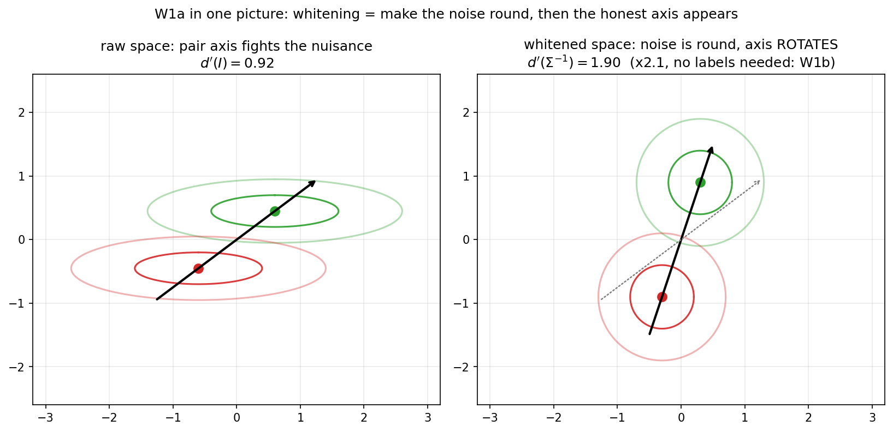
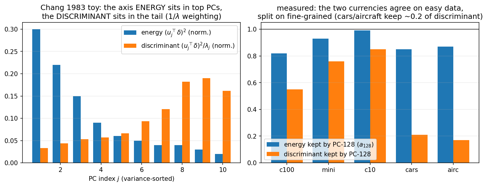
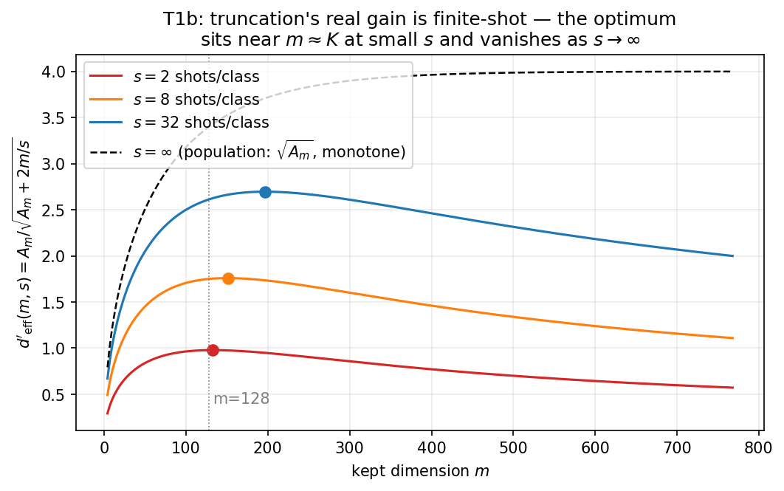
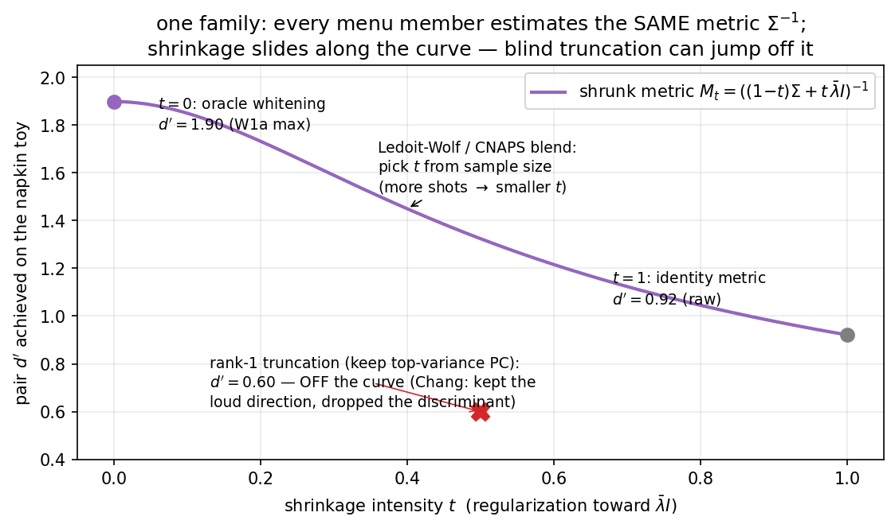
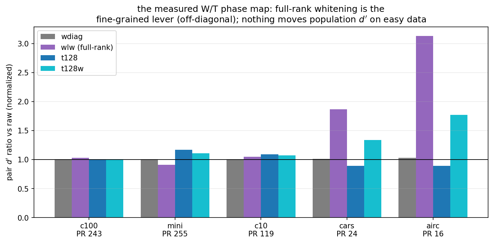
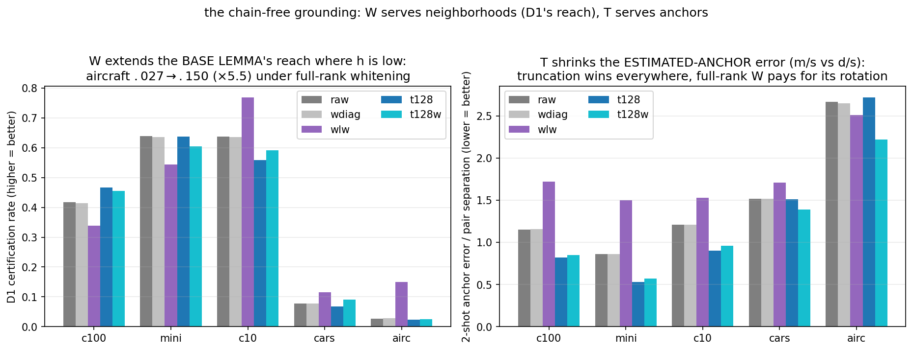

# Lemmas W1 and T1, letter by letter — a learning edition

Status: v1.0 (2026-08-16). Companion to `docs/dwt_wt_lemmas.md` (the
research edition, plain-ASCII) and sibling of
`docs/dwt_d3_learning_edition.md` (the D-phase learning edition — read that
one first if you haven't; this file reuses its conventions and its $d'$
currency). This file is **pedagogical**: every symbol is introduced before
use, every proof step is annotated with *why* it is legal, and one 2-D toy
is carried through both lemmas so you can compute everything by hand.

> **How to read this file.** The math is real LaTeX (`$...$`). It will NOT
> render in a raw terminal — open in **VS Code and press `Ctrl+Shift+V`**,
> or view on GitHub / Obsidian / Typora. The research edition
> (`dwt_wt_lemmas.md`) uses the same LaTeX format and identical symbols
> (converted 2026-08-18, user preference — clearer than the old ASCII).

> **STATUS AFTER THE GROUNDING SHIFT (2026-08-18) — read this first.**
> Sections 4–8 teach the lemmas in the $d'$ currency, and they are still
> the right thing to learn — but the *load-bearing* justification of W/T
> no longer runs through the $d' \to$ Lemma B $\to$ Prop C chain (D3's
> quantitative layer is empirically unsupported, so the theory's base is
> D1, and the ideal $\mathbb{E}|C^T| \le \mathbb{E}|C|$ endpoint is
> aspirational). The load-bearing story is **Section 10.1**: W and T are
> justified *chain-free*, as services to the two objects D1 and the score
> already use — W raises neighborhood homophily (D1's only free input;
> measured: aircraft's D1 certification rate jumps $\times 5.5$ under
> full-rank whitening), T cuts estimated-anchor error (exact $m/s$ vs
> $d/s$ rate). The $d'$ machinery of Sections 4–8 remains as instruments
> and as the aspirational route.

> **The build principle (decided 2026-08-16).** D1 is the *base lemma* of
> the Denoise phase: deterministic, assumption-free, one triangle
> inequality, empirically validated pointwise on all five datasets. W1 and
> T1 are built the same way: an **exact, one-line-proof core** first
> (W1a, T1a — no probability, no models), then the statistically loaded
> refinements as *named, conditional clauses* with signed violations and a
> measurement instrument (`src/wt_phase_diagnostics.py`). If you remember
> one design rule: **prove the geometry exactly, then let the statistics
> be honest about what they add.**

**Verification note.** The W1a and T1a algebra below was re-derived
independently of the research edition during writing; the Section-4 toy
numbers ($d'=0.92 \to 1.90$) were computed by hand and match the figure
script (`src/plot_wt_learning_figs.py`, closed-form, deterministic); the
measured table (Section 8) is copied from
`output/dwt_theory/wt_phase_diagnostics.json` (run 2026-08-16, seed 42).

---

## 1. The story in plain words (no math)

After Denoise (qe), the pipeline applies two more pool-fit transforms:
**W**hiten, then **T**runcate. Empirically they are the BIGGER levers:
PCA-128 + cluster-whitening is the champion engine on CIFAR-100-like data,
while on Aircraft PCA is a no-op-to-harmful and full-rank Ledoit-Wolf
whitening at 768 dims is the champion. We want lemmas that explain both
regimes — and the flip between them — as sharply as D1/D3 explain qe.

The two intuitions to hold onto:

- **Whitening makes the noise round so distances tell the truth.** If the
  within-class scatter is elongated (some directions noisy, some quiet),
  then raw distances — and the raw pair axis between two class means —
  mix signal with nuisance. Dividing out the noise shape ($\Sigma^{-1/2}$)
  makes every direction equally noisy; in that space the straight line
  between the class means *is* the statistically honest axis. That is the
  whole W phase.
- **Truncation is a bet about where the signal lives.** Keeping the top-$m$
  variance directions of the pool throws away the rest. If class
  separation lives in the kept directions, you lose nothing and gain a
  cheaper, *more estimable* space (fewer dimensions = less noise in your
  few-shot class means). If separation hides in the *low-variance tail* —
  which really happens; it has been a named theorem-level warning since
  Chang 1983 — truncation destroys it and **no later step can bring it
  back**.

And the two surprises the measurement produced (Section 8):

- On fine-grained data, whitening's power is the **rotation** (the
  off-diagonal covariance structure), not the per-dimension rescale: the
  deployed diagonal whitening moves pair-$d'$ by $\times 1.00$ everywhere,
  full-rank whitening by $\times 3.13$ on Aircraft.
- On easy data, *none* of the transforms moves population $d'$ — the
  pipeline's set-size wins there are **finite-shot effects** (truncation
  makes class prototypes estimable from few labels), not geometry. The
  lemma that explains PCA's payoff is a statement about *estimated*
  prototypes, not about the population.

---

## 2. The cast of characters

| symbol | meaning | where it lives |
|---|---|---|
| $\mu_c$ | class anchor (population class mean) | data model (M1) |
| $\delta = \mu_y - \mu_c$ | pair separation vector for a confusable pair | per pair |
| $\Sigma$ | shared within-class covariance ("the noise shape") | (M1) |
| $A$, $M = A^\top A$ | linear transform and its metric — only $M$ matters | the transform |
| $d'(M)$ | pair discriminability after the transform | the one currency |
| $P_m$ | orthogonal projector onto $m$ kept directions | Truncate |
| $a_m = \|P_m\delta\|^2/\|\delta\|^2$ | **alignment**: fraction of the pair axis kept | T1a |
| $A_m = \|P_m\delta\|^2$ | kept squared separation (whitened units) | T1b |
| $s$ | labeled shots per class (prototype sample size) | T1b |
| $\lambda_j, u_j$ | pool covariance eigenvalues/vectors (variance-sorted) | T1c, Chang |
| PR | participation ratio $(\sum\lambda_j)^2/\sum\lambda_j^2$ of the pool spectrum | the dial |

The one formula everything revolves around — the pair discriminability in
the transformed space, along the transformed pair axis:

$$
d'^2(M) \;=\; \frac{(\delta^\top M\, \delta)^2}{\delta^\top M \Sigma M\, \delta}.
$$

*Where does this come from?* In the transformed space the two class means
sit at $A\mu_y$ and $A\mu_c$; project points onto the axis between them,
$v = A\delta/\|A\delta\|$. The projected separation is $\|A\delta\|$ and
the projected noise variance is $v^\top A\Sigma A^\top v$; substitute
$A^\top v = M\delta/\|A\delta\|$ and simplify. Setting $M=I$ gives the raw
discriminability $d'^2(I) = (\delta^\top\delta)^2/(\delta^\top\Sigma\delta)$.
Truncation is the degenerate metric $M = P_m$. This is the same $d'$ that
Theorem D3 uses for the Denoise phase — so the three phases speak one
currency and their ratios multiply.

---

## 3. A napkin toy (carried through everything)

Two dimensions. Noise shape $\Sigma = \mathrm{diag}(4, \tfrac14)$: the
horizontal direction is noisy (variance 4), the vertical is quiet
(variance $\tfrac14$). Pair separation $\delta = (1.2,\, 0.9)$ — mostly
horizontal in *energy*, but watch what happens.

- Raw: $\delta^\top\delta = 2.25$, $\delta^\top\Sigma\delta = 4(1.44) +
  \tfrac14(0.81) = 5.96$, so $d'(I) = 2.25/\sqrt{5.96} = 0.92$.
- Whitened maximum: $\delta^\top\Sigma^{-1}\delta = \tfrac{1.44}{4} +
  \tfrac{0.81}{1/4} = 0.36 + 3.24 = 3.60$, so $d'(\Sigma^{-1}) =
  \sqrt{3.60} = 1.90$. A $\times 2.1$ improvement.
- Where did it come from? Decompose $3.60$: the noisy direction
  contributes $0.36$ (10%), the quiet direction $3.24$ (**90%**). The
  quiet component of $\delta$ — only $0.9$ long — carries almost all the
  discriminative power, because discriminability weights each direction by
  $1/\lambda_j$. This is Chang's 1983 point, in two dimensions.
- Now truncate to the top-variance direction ($m=1$, keep horizontal):
  energy kept $a_1 = 1.44/2.25 = 0.64$ — looks fine! — but the
  discriminant kept is $0.36/3.60 = 0.10$. **Energy and discriminant are
  different currencies**, and truncation is judged in the wrong one if you
  only look at $a_m$.



*Left: raw space. The ellipses are the noise; the black arrow is the pair
axis, which fights the horizontal nuisance. Right: after whitening the
noise is round, and the honest axis (black) has ROTATED toward the quiet
direction (the dotted gray arrow is where the raw axis pointed). The gain
$0.92 \to 1.90$ is real, label-free (W1b), and mostly rides the rotation —
which is exactly finding F1 in the measured table.*

---

## 4. Lemma W1a — whitening is the best possible metric (exact core)

### 4.1 What it says

For every pair $(y,c)$ and **every** positive semidefinite metric $M$:

$$
d'^2(M) \;\le\; \delta^\top \Sigma^{-1}\delta,
$$

with equality iff $M\delta \parallel \Sigma^{-1}\delta$ — in particular at
$M = \Sigma^{-1}$ (whitening), which attains the maximum **for every pair
at once**. And whitening never hurts:
$d'^2(\Sigma^{-1}) \ge d'^2(I)$, with equality iff $\delta$ is an
eigenvector of $\Sigma$.

Read it twice: it is a statement about *all* linear preprocessing at once.
Any PCA, any rescaling, any learned linear metric — none of them can beat
plain within-class whitening on any pair, ever (population-level). The
entire W/T design space is a search *inside* this bound.

### 4.2 The proof, annotated (one Cauchy-Schwarz)

Define two helper vectors:

$$
a = \Sigma^{1/2} M \delta, \qquad b = \Sigma^{-1/2}\delta .
$$

*Why these?* Because they make the three quadratic forms in $d'^2(M)$
into inner products: $a^\top b = \delta^\top M\delta$ (the numerator's
root), $a^\top a = \delta^\top M\Sigma M\delta$ (the denominator), and
$b^\top b = \delta^\top\Sigma^{-1}\delta$ (the claimed maximum). Then

$$
d'^2(M) = \frac{(a^\top b)^2}{a^\top a} \;\le\; b^\top b
$$

is literally the Cauchy-Schwarz inequality $(a^\top b)^2 \le
(a^\top a)(b^\top b)$, divided by $a^\top a$. Equality iff $a \parallel b$,
i.e. $M\delta \parallel \Sigma^{-1}\delta$. The never-hurts clause is the
same inequality once more with $M = I$:
$(\delta^\top\delta)^2 \le (\delta^\top\Sigma\delta)
(\delta^\top\Sigma^{-1}\delta)$. $\blacksquare$

*What made it this easy?* $\Sigma^{1/2}$ is the change of variables into
the round-noise world. In that world the noise is isotropic, so the best
axis for separating two means is trivially the line between them; every
other choice loses by exactly the angle it makes with that line.
Cauchy-Schwarz is that sentence in symbols.

*Grade check (vs D1):* deterministic, per-pair, assumption-free (any
$\Sigma \succ 0$), one line. Same epistemic grade as D1's triangle
inequality. The instrument verifies it the same way D1 was verified:
**zero bound violations** across all pairs on all five datasets.

---

## 5. Lemma W1b — the pool can fit it without labels (the SM miracle)

### 5.1 The problem

$\Sigma$ is the *within-class* covariance — it seems to need labels. The
pool gives us only the *total* covariance
$\Sigma_T = \Sigma + \Sigma_B$, where $\Sigma_B$ is the between-class
scatter (how the class means themselves spread). Does whitening by the
wrong matrix $\Sigma_T$ ruin W1a?

### 5.2 Two classes: no — it is EXACTLY as good

For a two-class mixture, $\Sigma_B = \pi_y\pi_c\,\delta\delta^\top$
(a rank-one bump *along the pair axis itself*). Apply Sherman-Morrison:

$$
\Sigma_T^{-1}\delta
= \left(\Sigma + \pi_y\pi_c\,\delta\delta^\top\right)^{-1}\delta
= \frac{\Sigma^{-1}\delta}{1 + \pi_y\pi_c\,\delta^\top\Sigma^{-1}\delta}.
$$

*Annotate the miracle:* the between-class contamination inflates
$\Sigma_T$ **exactly along $\delta$** — and inverting deflates along that
same direction. Deflation changes the *length* of $\Sigma_T^{-1}\delta$,
never its *direction*. But W1a's equality condition only cares about
direction ($M\delta \parallel \Sigma^{-1}\delta$). So:

$$
d'^2(\Sigma_T^{-1}) = \delta^\top\Sigma^{-1}\delta = d'^2(\Sigma^{-1}).
$$

**Pool total-covariance whitening attains the label-oracle maximum with
zero labels.** This is the strongest no-labels statement anywhere in the
DWT theory — stronger than anything in the D phase, where selection bias
is irreducible.

### 5.3 K classes: directions still exact, a low-rank correction appears

With $K$ classes, $\Sigma_B$ has rank $\le K-1$ and points along *other*
mean differences too; Woodbury leaves a contamination of
$\Sigma_T^{-1}\delta$ confined to a $(K{-}1)$-dimensional subspace of a
768-dimensional space. Fukunaga's classical identity says the *discriminant
directions* of $\Sigma_T^{-1}\Sigma_B$ and $\Sigma^{-1}\Sigma_B$ coincide
exactly (only eigenvalues re-map, monotonically). The exact per-pair $d'$
shortfall bound is the named gap **GW1** (severity: low).

### 5.4 Estimation reality (W1c) — and what the data said

Real pool whitening estimates $\Sigma$ from k-means pseudo-clusters,
Ledoit-Wolf-shrunk (full-rank) or diagonal (deployed engine). Two named
clauses: **GW2a** (LW's quadratic-loss consistency at $n < d$ must be
composed with $d'$ continuity — standard) and **GW2b** (impure
pseudo-clusters leak between-class displacement into $\hat\Sigma$).
The measurement (Section 8) then said two humbling things:

1. **Diagonal whitening does nothing to population $d'$** ($\times$1.00 on
   all five datasets). The win of whitening is the eigenbasis rotation —
   the off-diagonal structure — which a per-dimension rescale cannot see.
   (In the toy: $\Sigma$ is already diagonal, so the rescale IS the
   rotation there; in real embeddings the quiet directions are not
   axis-aligned.)
2. **Full-rank whitening can mildly hurt in sample** (mini $\times$0.91):
   when raw $d'$ is already 5.7, LW estimation noise from 20 coarse
   pseudo-clusters costs more than the rotation buys. W1c is not
   decorative — it is the reason W is not free on easy data.

### 5.5 The few-shot field already ran our ablation (Simple CNAPS)

If W1a feels abstract, here is the same statement discovered
independently, at benchmark scale, by people who weren't thinking about
conformal prediction at all. **Simple CNAPS** (Bateni et al., CVPR 2020)
took a state-of-the-art few-shot system and *deleted its meta-learned
classifier head* (788k parameters), replacing it with softmax over
$-\tfrac12 (x-\mu_k)^\top Q_k^{-1}(x-\mu_k)$ — class-mean prototypes
under an estimated covariance metric. Their own words for why: Euclidean
prototypes "implicitly assume each cluster is distributed according to a
unit normal." **Choosing a distance IS choosing a density model** — and
if the true within-class scatter is not round, the round-model rule is
just wrong. Measured on Meta-Dataset (8 domains):

$$
\text{Mahalanobis } 72.2\% \;>\; \text{squared Euclidean } 69.6\%
\;>\; \text{cosine } 68.3\%,
$$

a $+6.1$-point gain over the *learned* head, from a parameter-free
metric. That gap is the price of the isotropy assumption on frozen deep
features — the empirical shadow of W1a's inequality. Their covariance
estimator is even our W1c in deployed form:
$Q_k = \lambda_k \Sigma_k + (1-\lambda_k)\Sigma_{\text{task}} + \beta I$
with $\lambda_k = \frac{n_k}{n_k+1}$ — trust the class covariance as
shots grow, fall back to the pooled one when starved (their pooled
$\Sigma_{\text{task}}$ is our total covariance; Section 5.2 is the
theorem for why that fallback is nearly free). The follow-up
(Transductive CNAPS, WACV 2022) refines $Q_k$ with **unlabeled**
examples — pool-fit whitening in deployed form, minus exchangeability
and validity, which is exactly the gap our version fills.

---

## 6. Lemma T1a — truncation, the exact accounting

### 6.1 What it says

Work in the whitened metric (the pipeline order: W before T; noise
isotropic). For any orthogonal projector $P_m$ and every pair:

$$
\frac{d'_m}{d'} = \sqrt{a_m}, \qquad
a_m = \frac{\|P_m\delta\|^2}{\|\delta\|^2} \in [0,1].
$$

*Proof (one line):* projected separation $= \|P_m\delta\|$; isotropic
noise has sd 1 along every axis, before and after projecting; divide.
$\blacksquare$

The brutal consequence: **post-whitening, truncation can only lose.**
Population-wise there is nothing to gain — $a_m \le 1$ always. So the
empirical fact that PCA-128 is the champion engine on CIFAR-100 *cannot*
be a population-geometry effect. Something else must pay for it. That
something is T1b.

### 6.2 Remark T1a′ — un-whitened truncation is crude whitening

Before whitening, dropping a direction with huge nuisance variance and
tiny $\delta$-content *does* raise $d'$ — it is an infinitely aggressive
down-weighting of that direction, i.e. a blunt special case of W1a's
optimal metric. This is why `t128` (PCA alone, no whitening) helps on
mini/cifar10 ($\times$1.17/$\times$1.09 measured, *above* the
$\sqrt{a_{128}}$ post-whitening prediction): the discarded 640 dims held
nuisance, not signal. Truncation-helps is always W1a wearing a cheaper
coat.

### 6.3 The Chang split — why $a_m$ is the wrong dial alone



*Left: toy spectrum. Blue = how much of the pair axis's ENERGY each PC
carries (top-heavy). Orange = how much DISCRIMINANT each PC carries —
the same energies re-weighted by $1/\lambda_j$ (tail-heavy). Right: the
measured five datasets. Blue ($a_{128}$) is high everywhere — 0.82–0.99,
including Aircraft at 0.87. Orange (discriminant kept by PC-128) splits
the regimes: easy data keeps 0.55–0.85, cars/aircraft keep only ~0.2.*

This is measured finding **F4** and it corrects the folklore: Aircraft's
truncation failure is **not** "the pair axis is orthogonal to the top
subspace" (it isn't — $a_{128}=0.87$). It is that the axis's
*discriminant-dense component* — the low-variance 13% of its energy — is
what truncation discards. Exactly the napkin toy, exactly Chang 1983:
discriminability weights directions by $1/\lambda$, so the quiet tail can
dominate, and the variance ordering used by PCA "bears no relation" (his
phrase) to the discriminant ordering. Whitening would have up-weighted
that tail; truncating first destroys it — hence measured finding **F3**:
on Aircraft, truncate-then-whiten recovers only $\times$1.77 of
full-rank whitening's $\times$3.13. **Order matters, and W-before-T is
the theorem-consistent order.**

**The T bet, stated with the SSL literature's own words.** Why does
truncation usually get away with it on SSL embeddings? Because SSL
spectra really do have a *dead* tail: Jing et al. (ICLR 2022) showed
contrastive SSL suffers **dimensional collapse** — a set of embedding
covariance singular values driven to $\approx 0$ by augmentation
strength and implicit regularization. Cutting collapsed directions
discards nothing; $a_m \approx 1$ is *structural* on collapse-shaped
spectra. Chang is the opposite world: a *live* tail carrying the
discriminant. So T is a bet — **is the tail dead (Jing) or alive
(Chang)?** — and the pool spectrum answers it without labels: high
PR/effective-rank $\to$ dead tail, cut freely; low PR $\to$ live tail,
don't cut, whiten full-rank instead. Our five-dataset table is that
dichotomy, measured.

---

## 7. Lemma T1b — what truncation actually buys: estimable prototypes

### 7.1 The setup

Prototypes are *estimated* from $s$ shots per class:
$\hat\mu = \mu + \varepsilon/\sqrt{s}$ with isotropic $\varepsilon$ in the
whitened, $m$-dimensional retained space. The estimated pair axis is

$$
\hat v \;\propto\; P_m\delta + \eta,
\qquad \mathbb{E}\|\eta\|^2 = \frac{2m}{s}
$$

($\eta$ = the difference of two prototype errors: variance $1/s$ each,
per dimension, $m$ dimensions, two classes). The axis you *use* wobbles
around the axis you *want*, and the wobble grows with the dimension you
kept.

### 7.2 What it says

$$
\mathbb{E}\!\left[\cos^2(\hat v, v)\right] \approx \frac{A_m}{A_m + 2m/s},
\qquad
d'^2_{\mathrm{eff}}(m,s) \;\approx\; \frac{A_m^2}{A_m + 2m/s},
$$

with $A_m = \|P_m\delta\|^2$ (kept squared separation, whitened units).
The first factor is signal-energy over signal-plus-wobble-energy (the
standard "alignment of a noisy direction estimate"); the effective $d'$
multiplies the population $\sqrt{A_m}$ by the alignment $\cos(\hat v, v)$
while the projected noise stays 1 by isotropy.

### 7.3 Read the formula — it derives the whole PCA phenomenology



$m$ enters **twice with opposite signs**: $A_m$ rises with $m$ (keep more
of the axis) while $2m/s$ rises with $m$ (estimate more coordinates from
the same few shots). Consequences, each a known empirical fact:

- **Interior optimum $m^\ast$.** If the class-mean subspace sits in the
  top spikes of the pool spectrum (Vempala-Wang: between-class scatter IS
  a rank-$(K{-}1)$ spike of the total covariance), $A_m$ saturates by
  $m \approx K \ll d$ — and everything kept beyond that pays the $2m/s$
  tax for nothing. At $s=2$, $d=768$: going from 768 to 128 dims cuts the
  tax six-fold at no alignment cost. *That* is the PCA-128 win.
- **The win vanishes as $s$ grows** (the dashed $s=\infty$ curve is
  monotone — no interior optimum). Matches "PCA payoff largest at small
  cal" and finding F2: on CIFAR-100 all population ratios are
  $\times$1.00; the pipeline's gain lives entirely in this finite-shot
  channel.
- **No $m$ rescues a dead numerator.** On Aircraft the discriminant-dense
  component is outside every top-$m$ choice (Section 6.3), so the
  numerator $A_m$ (in *discriminant* currency) is small at every $m$ —
  truncation harm is not tunable, the T-twin of D3's corollary C2.

*Status:* conditional (Gaussian isotropic prototype noise; axis-wobble
dominant) — gap **GT2**. The raw-space instrument confirms the ordering
and the $s$-scaling (cos² rises with $s$ on every dataset, Aircraft lowest
at fixed $s$); the whitened-metric quantitative check is a registered
follow-up.

### 7.4 The unifying picture: one family, one dial



Put W and T back together and the whole menu becomes one object. Every
transform we deploy — and Simple CNAPS's classifier, and the raw
baseline — is a **regularized estimator of the same W1a-optimal metric**
$\Sigma^{-1}$:

| member | regularizer | character |
|---|---|---|
| oracle $\Sigma_w^{-1}$ | none (labels) | the W1a maximum |
| `lw768` (aircraft champion) | shrink toward $\bar\lambda I$ | soft |
| CNAPS $Q_k$ | shot-indexed hierarchical shrink | soft |
| `t128w` (separable champion) | rank-128 cut + diagonal | blunt |
| `wdiag` (engine) | diagonal restriction | blunt (no rotation) |
| raw / Euclidean prototypes | full shrink to $I$ | the $t{=}1$ end |

The figure shows the family on the napkin toy: shrinkage *slides* along
one curve between the oracle ($d'=1.90$) and raw ($d'=0.92$) — sample
size decides where you can afford to sit — while **blind truncation can
jump off the curve entirely** ($d'=0.60$: kept the loud direction,
dropped the discriminant). Under this frame T stops being a separate
mystery: it is the *blunt* regularizer in the same estimation problem,
justified exactly where CNAPS's $\lambda_k$ blend is justified (too few
samples for full-rank, T1b) and contraindicated exactly where the cut
removes discriminant mass (Chang, F4). The regime rule in one sentence:
**low PR $\to$ live tail $\to$ soft regularizer (`lw768`); high PR +
starved labels $\to$ dead tail $\to$ blunt regularizer wins on
estimation savings (`t128w`).**

---

## 8. Reading the measured table

`src/wt_phase_diagnostics.py`, five datasets, all transforms pool-fit
(k-means 20, seed 42), nearest-prototype pairs fixed from raw class means:

```
dataset        d'raw  wdiag  wlw    t128   t128w | a_128  sqrt  changTail  PR    s=2cos2 s=8cos2
cifar100       3.93   x1.00  x1.03  x1.00  x1.00 | 0.82   0.91  0.45       243   0.32    0.63
miniimagenet   5.66   x1.00  x0.91  x1.17  x1.11 | 0.93   0.96  0.24       255   0.50    0.77
cifar10        5.45   x1.00  x1.05  x1.09  x1.07 | 0.99   1.00  0.15       119   0.32    0.63
stanford_cars  2.85   x1.01  x1.87  x0.89  x1.34 | 0.85   0.92  0.79       24    0.23    0.54
aircraft       1.67   x1.03  x3.13  x0.89  x1.77 | 0.87   0.93  0.83       16    0.15    0.33
```



Walk one cell by hand — **aircraft, t128**: T1a predicts
$d'_{128}/d' = \sqrt{a_{128}} = \sqrt{0.87} = 0.93$; measured $0.89$.
The identity is nearly exact, and the small shortfall has the predicted
sign (the *sample* PCs chase the structured bulk, GT1). Now the same
dataset, **wlw**: $\times 3.13$ — the same information that truncation
threw away, harvested instead by the $1/\lambda$ re-weighting. One
dataset, two opposite verdicts, one mechanism (the Chang tail,
`changTail` 0.83).

The verdict pattern in one sentence each:

- **wdiag $\approx$ 1.00 everywhere** — the deployed diagonal rescale
  does not move population geometry; whitening's power is off-diagonal
  (F1).
- **wlw** — the fine-grained lever ($\times$1.87 cars, $\times$3.13
  aircraft), mildly negative on mini (estimation cost, W1c).
- **t128 vs $\sqrt{a_{128}}$** — matches on the harm side (0.89 vs
  0.92/0.93), exceeds on the easy side (T1a′ crude whitening).
- **t128w** — recovers part of wlw but never all of it on fine-grained
  data: truncation first, then whitening = the tail is already gone (F3).
- **PR** separates the regimes (243/255/119 vs 24/16); the crude
  Marchenko-Pastur spike count does **not** (233–281 everywhere) — the
  bulk is structured on every dataset, which is GT1's point made by a
  failed instrument. The spectrum-as-dial idea is not ours alone:
  **RankMe** (Garrido et al., ICML 2023) showed the spectral-entropy
  effective rank of SSL embeddings — a smooth cousin of PR — predicts
  downstream accuracy across 110 models × 11 datasets with zero labels
  (their one-line reason: a linear readout cannot *increase* rank, so
  embedding rank caps what any downstream classifier can separate). And
  their registered exception — the one benchmark where rank-monotonicity
  breaks — is **Stanford Cars**, the same dataset that sits mid-regime in
  every table of ours. The dial is published; our contribution is wiring
  it to a *decision* (which regularizer) with the Chang mechanism behind
  it.
- **Headroom (F6):** pool whitening reaches only 23–44% of the labeled
  Mahalanobis oracle everywhere, and the fraction is NOT ordered by
  homophily — so cluster *impurity* is not the limiter; either the oracle
  flatters itself (inverted small eigenvalues) or finer/purer clustering
  has a real 2–4$\times$ unclaimed $d'$. Discriminating experiment
  registered in the research edition.

---

## 9. What is assumed where — the honest ledger

| gap | clause | in words | severity |
|---|---|---|---|
| GW1 | W1b | $K$-class: bound the $d'$ shortfall of total-vs-within whitening (directions exact, rank-$(K{-}1)$ rescale) | low |
| GW2a | W1c | compose Ledoit-Wolf consistency with $d'(\hat M)$ continuity | low-med |
| GW2b | W1c | pseudo-cluster impurity → $\hat\Sigma$ leakage; per F6, reframe toward *granularity*, not just purity | medium |
| GT1 | T1c | the pool bulk is a structured field, not white noise — sample PCs chase it; restate in Chang-functional terms (F4/F5) | medium |
| GT2 | T1b | finite-shot constants beyond Gaussian-isotropic; whitened-metric quantitative check | low-med |

What needs NO ledger entry: W1a and T1a themselves. They are exact, and
the instrument confirms them the way D1 was confirmed (zero bound
violations; $\sqrt{a_m}$ identity within 0.04 on the harm side).

---

## 10. Why the pipeline is justified — the load-bearing story and the aspirational chain

### 10.1 The chain-free grounding (load-bearing, 2026-08-18)

Forget distributions for a moment and ask: before any theorem about score
CDFs or expected set sizes, what does the pipeline *actually use*? Two
primitive objects:

1. **Neighborhoods** — who counts as close. D1, the assumption-free base
   lemma, certifies per point that smoothing repairs it, and its
   condition has exactly one dataset-dependent input: the pool-kNN
   homophily $h_w(x)$ (through the impurity budget
   $(1-h_w)\Delta_F$). Here is the key observation: *neighborhoods are
   computed by the metric*. Change the metric, change who your neighbors
   are, change $h_w$ — change how far the base lemma reaches. **That is
   W's job.** In the raw metric, cosine proximity is dominated by the
   shared-field nuisance directions (your neighbors match your pose and
   background, not your class); whitening downweights exactly those
   directions, so neighbors become classmates.
2. **Anchors** — the estimated prototypes $\hat\mu_c$, the only estimated
   object in the score. With $s$ shots the anchor error has retained
   noise trace $m/s$ in an $m$-dimensional space: cut $d = 768$ to
   $m = 128$ and the estimate provably gets closer to the true anchor —
   a D1-shaped statement (*the estimated object's distance to its truth
   improves, at an exact rate, under a measurable condition* $a_m$).
   **That is T's job**, and it's T1b with the $d'$ packaging removed.



The measurement (`src/wt_chainfree_diagnostics.py`, predictions
registered before the run):

```
                     h_w                    D1 cert rate            anchor err (s=2)
dataset        raw   wlw   t128w  |  raw   wlw   t128  t128w |  raw   wlw   t128w
cifar100       .809  .784  .821   |  .417  .338  .466  .455  |  1.15  1.72  0.85
miniimagenet   .917  .894  .918   |  .638  .543  .637  .605  |  0.86  1.50  0.57
cifar10        .971  .971  .972   |  .637  .768  .559  .592  |  1.21  1.53  0.96
stanford_cars  .467  .545  .538   |  .077  .116  .068  .091  |  1.52  1.71  1.39
aircraft       .261  .337  .347   |  .027  .150  .023  .026  |  2.67  2.51  2.22
```

Read it in three sentences. **W works where it's needed:** on the
fine-grained datasets whitening turns wrong-class neighbors into
classmates ($h_w$: aircraft $.261 \to .337$, cars $.467 \to .545$) and
the D1 certification rate follows — **aircraft $.027 \to .150$, a
$5.5\times$ extension of the base lemma's reach** (on the easy datasets
there is nothing to buy and wlw's estimation noise mildly costs — the
same cost as its $\times 0.91$ cell in Section 8). **T works where labels
are scarce:** the 2-shot anchor error drops 25–40% under truncation on
every separable dataset, while full-rank whitening *worsens* anchors on
4/5 (its rotation upweights noisy-estimate directions). **And the
punchline: the per-dataset argmax of the D1 certification rate nearly
reproduces the deployed champion menu** — aircraft/cars $\to$ full-rank
W, cifar100 $\to$ truncation family — so the base lemma alone, with zero
distributional assumptions, sorts the W/T menu the same way months of
set-size experiments did. The two services trade off (wlw maximizes
reach but costs anchors; t128 the reverse; aircraft's t128w cert $.026$
vs wlw's $.150$ is Chang's tail again, in certification currency), and
which service binds is what the label-free PR dial reads.

This is the justification that survives the grounding shift: **W and T
are the transforms that maximize what the assumption-free part of the
theory can certify** — no Lemma B, no Prop C, no Gaussian anything.

**Does the order follow?** Conceptually yes — the stages chain by
precondition (W is unconditional and repairs the metric; D's lemma is
homophily-gated, and homophily is a property of that metric; T is
well-posed only after W makes variance order equal discriminant order —
Chang). That chain reads W $\to$ D $\to$ T, and since W raises $h_w$, we
tested whether running qe AFTER whitening helps (research edition §7.4).
It does not: the qe $d'$-ratio moves by $\le 0.1$ in every space and
never flips a sign — whitening fixes your neighbors' *labels*, but qe's
fine-grained harm is the *field direction*, which re-selecting neighbors
does not redirect (the mean-field-mover mechanism, fourth appearance).
So the order knob joins $\beta$, $k$, $a$, and hop count on the
no-rescue frontier; the deployed D $\to$ W $\to$ T stands, and the one
ordering constraint with teeth — whiten before truncating when the tail
is alive — is enforced by the PR-gated menu choice, not by reordering.

### 10.2 The aspirational chain (kept, demoted)

All three phases also output a multiplier on the pair margin $d'$, and in
the composed metric the pipeline ratio factorizes,

$$
\frac{d'_{\mathrm{DWT}}}{d'_{\mathrm{raw}}} \;=\;
\underbrace{\text{(W ratio)}}_{\le\, \text{W1a max}} \times
\underbrace{\text{(T ratio)}}_{\sqrt{a_m}\ \text{or T1b}} \times
\underbrace{\text{(D ratio)}}_{\text{D3 gate}},
$$

which is what Lemma B (margin $\to$ score distribution) and Proposition
C / Corollary D4 (dominance or contraction-anchor $\to$
$\mathbb{E}|C^T| \le \mathbb{E}|C|$ at exact coverage) would consume —
agnostic to which phase moved $d'$. If G6's conditions are ever
discharged, this chain upgrades the story from "W/T extend D1's reach"
to "W/T provably shrink expected set size". Until then it is the
*aspirational* route, and the honest status is: instruments proved, chain
conditional. Coverage, as always, is exact regardless — every transform
here is pool-measurable, so validity never depended on any of this
(research edition §7 of `dwt_denoise_theorem.md`).

---

## 11. Literature map (tags → what was actually borrowed)

Full annotated stack with links and reading order:
`docs/classification_theory_anchors.md` (§4–5). The load-bearing five here:

- **Chang 1983** [C83]: low-variance PCs can dominate the discriminant —
  Section 6.3's split is his theorem, measured.
- **Bar-Hillel et al. 2005 (RCA)** + **Fukunaga ch. 10**: W1a's optimality
  in its published forms; the total-vs-within identity behind W1b.
- **Paul 2007 / BBP 2005**: sample-PC overlap and the detectability
  threshold — T1c's conditional layer (used qualitatively here; the
  white-bulk version demonstrably fails on our data, see PR/spike row).
- **Ledoit-Wolf 2004**: the $n<d$ license for full-rank whitening (W1c).
- **Vempala-Wang 2004** / **Loffler-Zhang-Zhou 2021**: means-in-top-spikes
  and the end-to-end unlabeled projection bound — T1b's saturation story.
- **Simple CNAPS (CVPR 2020) / Transductive CNAPS (WACV 2022)**: the
  few-shot field's deployed version of our W stage — Mahalanobis
  prototype rule with shot-indexed shrinkage (§5.5); the +6.1-point
  Meta-Dataset ablation is W1a's empirical shadow at benchmark scale.
- **RankMe (ICML 2023)** / **Jing et al. (ICLR 2022)**: SSL-native
  justification of the T premise and the dial — effective rank of the
  embedding spectrum predicts downstream label-free (RankMe), and SSL
  spectra genuinely have collapsed (dead) tails to cut (dimensional
  collapse). §6.3's "dead or alive" bet and §8's PR row.

---

## 12. Self-test (think first, then check)

1. Why does W1a's proof need no assumption about the *distribution* of the
   noise, only its covariance?
2. In the napkin toy, compute $d'$ if you whiten but then truncate to the
   (whitened) top-variance direction. Is it better or worse than raw?
3. Diagonal whitening equals full whitening exactly when — ? (Hint: what
   must be true of $\Sigma$'s eigenbasis?)
4. T1a says truncation can't help after whitening. `t128` measured
   $\times$1.17 on miniImageNet. Contradiction?
5. Why does the T1b optimum $m^\ast$ move RIGHT (toward larger $m$) as $s$
   grows?
6. Aircraft: $a_{128} = 0.87$ yet truncation is harmful and whitening
   gives $\times$3.13. Reconcile in one sentence.
7. Simple CNAPS's $Q_k = \lambda_k\Sigma_k + (1-\lambda_k)
   \Sigma_{\text{task}} + \beta I$ with $\lambda_k = \frac{n_k}{n_k+1}$:
   which clause of W1 does each of the three terms correspond to, and
   what do WE have that they don't?
8. Chain-free grounding: D1's improvement condition is deterministic and
   assumption-free — so how can a *transform* change its certification
   rate at all? And why does t128w barely move aircraft's certification
   ($.026$) when wlw moves it to $.150$, even though both raise $h_w$ to
   $\approx .34$?

*Answers (sketch):* (1) $d'$ is defined from means and variances only;
Cauchy-Schwarz is algebra on quadratic forms. (2) Whitened top direction
is the QUIET-noise axis rescaled — post-whitening both directions have
equal variance and the toy's whitened $\delta_w=(0.6,1.8)$ has most energy
in the second coordinate; truncating to the *first* keeps $a_1 =
0.36/3.60 = 0.10$, $d' = \sqrt{0.36} = 0.6$ — worse than raw's 0.92.
Truncation choices are made in whitened currency or they lie. (3) When
$\Sigma$ is diagonal in the data's coordinate basis — real embeddings
aren't, hence F1. (4) No: T1a is post-whitening; `t128` acts on the
UN-whitened space where truncation moonlights as crude whitening (T1a′).
(5) The wobble tax $2m/s$ flattens as $s$ grows, so keeping more of
$A_m$ wins; at $s=\infty$ the curve is monotone (population limit). (6)
Truncation keeps 87% of the axis's energy but only 17% of its
discriminant, while full-rank whitening re-weights exactly the
low-variance component that carries the other 83%. (7)
$\Sigma_k$ = the W1a target (within-class covariance, per class);
$(1-\lambda_k)\Sigma_{\text{task}}$ = the W1b fallback (pooled/total
covariance standing in when shots are few — our Sherman-Morrison clause
explains why it's nearly free); $\beta I$ = the W1c shrinkage floor (our
Ledoit-Wolf clause, with a theorem instead of a constant). What we add:
the covariance is fit on an *unlabeled pool* with exchangeability
preserved (validity survives), and the regime theory saying when the
blunt regularizer (truncation) should replace the soft one. (8) D1 is
deterministic *given* the neighborhood — but the neighborhood is computed
BY the metric, so the transform changes who the neighbors are ($h_w$),
the anchor distances, and the ego's own error, and with them how many
points satisfy the inequality. The t128w-vs-wlw gap at equal $h_w$: the
certification condition also needs the neighbor-error term
$\sum (w/W) r_u$ small *relative to* $\varepsilon$, and that relative
geometry lives in the low-variance tail that truncation discarded —
Chang's split, surfacing a third time (after $d'$ and the champion
table) in certification currency.
